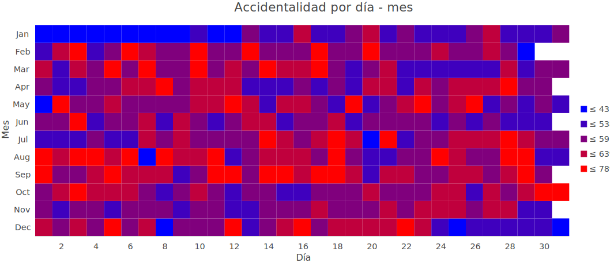

```{r echo=FALSE, message=FALSE, warning=FALSE}
library(dummies)
library(stringr)
library(dplyr)
library(lubridate)
library(ggplot2)
library(GGally)
library(car)
library(MLmetrics)
library(wordcloud)
library(gplots)
library(R.utils)
library(tm)
library(DescTools)
library(raster)
library(mclust)
library(rgdal)
library(raster)
library(geosphere)
library(NbClust)
library(factoextra)
library(vegan)
library(qpcR)
```

## Introducción

La alta accidentalidad en Medellín se está convirtiendo en un problema de salud pública (Concejo de Medellín, 2020), los accidentes de tránsito aparecen como la séptima causa de morbilidad en el planeta y más aún, ha sido considerada como la segunda causa que más genera muertes en Colombia (Sistemas y Comunicaciones FODC, s.f.). Esta “epidemia” es la primera causa de muerte de las personas menores de 40 años a escala mundial. (ARL SURA, 2020) 

Gracias a los datos abiertos presentados por la Alcaldía de Medellín, se puede acceder a las bases de datos de Movilidad de forma gratuita, donde muestra los Incidentes de Tránsito Georreferenciados por la Secretaria de Movilidad de la Alcaldía de Medellín, durante un periodo de tiempo de un año especifico. Entendiéndose por accidente de tránsito a un evento, generalmente involuntario, generado al menos por un vehículo en movimiento, que causa daños a personas y bienes involucrados en él, e igualmente afecta la normal circulación de los vehículos que se movilizan por la vía o vías comprendidas en el lugar o dentro de la zona de influencia del hecho (Alcaldía de Medellín, 2020).

El objetivo de este trabajo es que, a partir de técnicas en aprendizaje estadístico, se analicen, se modelen y se evalúen los datos (obtenidos como se mencionó anteriormente), para ello se realizó un análisis descriptivo y exploratorio de los datos, que permitió inferir y ver tendencias en el comportamiento de los mismos. Seguido de esto se crearon modelos estadísticos que predijeron la accidentalidad en Medellín diaria, semanal y mensual, en un periodo de tiempo de 4 años (Del año 2014 al 2017) y con el fin de identificar que los modelos se comportaran correctamente se evaluaron en los datos del año 2018. Finalmente se hizo un análisis de clasificación, donde se agruparon los diferentes barrios de la ciudad de Medellín (presentes en sus 16 comunas y 5 corregimientos) de acuerdo con su accidentalidad. 

```{r echo=FALSE}
# Función para Calcular el R2 en Modelos lineales generalizados
custom_R2 <- function(glm){
  return((glm$null.deviance - glm$deviance)/ glm$null.deviance) 
}

R2pseudo <- function (modelo) {
   R2pseudo <- (modelo$null.deviance - modelo$deviance)/modelo$null.deviance
}
```

```{r echo=FALSE}
datos_2014 <- read.csv("./BasesDeDatos/Incidentes_georreferenciados_2014.csv", 
                       sep = ",", encoding = "UTF-8")
datos_2015 <- read.csv("./BasesDeDatos/Incidentes_georreferenciados_2015.csv", 
                       header = T, sep = ",", encoding = "UTF-8")
datos_2016 <- read.csv("./BasesDeDatos/Incidentes_georreferenciados__2016.csv", 
                       header = T, sep = ",", encoding = "UTF-8")
datos_2017 <- read.csv("./BasesDeDatos/Incidentes_georreferenciados_2017.csv", 
                       header = T, sep = ",", encoding = "UTF-8")
datos_2018 <- read.csv("./BasesDeDatos/Incidentes_georreferenciados_2018.csv", 
                       header = T, sep = ",", encoding = "UTF-8")
holidays <- read.csv("./BasesDeDatos/holidays.csv", header = T, sep=",", encoding = "UTF-8")

```

```{r include=FALSE}
#UNION DE BASES
datos <- rbind(datos_2014,datos_2015, datos_2016, datos_2017)

#ELIMINAR COLUMNAS INNECESARIAS
datos <- datos[,-c(1,2,4,22,21)]

#ARREGLO DE VARIABLE GRAVEDAD
datos$GRAVEDAD <- as.factor(datos$GRAVEDAD)

#ARREGLO VARIABLE CLASE
datos$CLASE <- str_replace_all(datos$CLASE,"^\\s|\\s$", "")
datos$CLASE <- str_replace_all(datos$CLASE, "Ca(í|i)da d?e? ?Ocupante", 
                               "Caída Ocupante")
datos[datos$CLASE == "",6] <- "Otro"
datos$CLASE <- str_replace_all(datos$CLASE, "Choque y Atropello", 
                               "Otro")
datos$CLASE <- as.factor(datos$CLASE)

#ARREGLO VARIABLE BARRIO
datos$BARRIO <- str_replace_all(datos$BARRIO, "(.\\sNo\\.)\\s?(\\d)$", 
                                "\\1\\2")
datos$BARRIO <- str_replace_all(datos$BARRIO, "B. Cerro ? ?El Volador", 
                                "B. Cerro El Volador")
datos$BARRIO <- str_replace_all(datos$BARRIO, "Barrios? de Jesús", 
                                "Barrios de Jesús")
datos$BARRIO <- str_replace_all(datos$BARRIO, "Berl(í|i)n", "Berlín")
datos$BARRIO <- str_replace_all(datos$BARRIO, "L?a? ?Loma de (L|l)os Bernal", 
                                "La Loma de Los Bernal")
datos$BARRIO <- str_replace_all(datos$BARRIO, "Nueva Villa de (L|l)a Iguaná", 
                                "Nueva Villa de La Iguaná")
datos$BARRIO <- str_replace_all(datos$BARRIO, "Villa Lil?liam", 
                                "Villa Lilliam")
datos$BARRIO <- str_replace_all(datos$BARRIO, "9086", 
                                "Corregimiento de Santa Elena")
datos$BARRIO <- str_replace_all(datos$BARRIO, "6001",	
                                "Corregimiento de San Cristóbal")
x <- which(datos$BARRIO == "")
datos <- datos[-x,]
x1 <- which(datos$BARRIO == "Sin Nombre")
datos <- datos[-x1,]
datos[datos$BARRIO == "0",12] <- "Corregimiento de San Antonio de Prado"
datos$BARRIO <- str_replace_all(datos$BARRIO, "AUC1", 
                                "Cabecera Urbana San Cristobal")
datos$BARRIO <- str_replace_all(datos$BARRIO, "AUC2", 
                                "Cabecera San Antonio de Prado")
datos[datos$BARRIO == "Inst" & datos$COMUNA == "Guayabal", 12] <- "Parque Juan Pablo II"
datos[datos$BARRIO == "Inst" & datos$COMUNA == "Laureles Estadio", 12] <- "U.D. Atanasio Girardot"
datos[datos$BARRIO == "Inst" & datos$COMUNA == "La Candelaria", 12] <- "La Alpujarra"
datos$BARRIO <- str_replace_all(datos$BARRIO, "Suburbano el Tesoro", 
                                "Las Palmas")
datos <- datos[-c(datos$BARRIO == "Piedras Blancas"),]
datos$BARRIO <- str_replace_all(datos$BARRIO, "Piedras Blancas Represa", 
                                "Ocho de Marzo")
datos$BARRIO <- str_replace_all(datos$BARRIO, 
                                "Suburbano Mirador del Poblado", 
                                "Las Palmas")
datos$BARRIO <- str_replace_all(datos$BARRIO, "Suburbano Chacaltaya", 
                                "Las Palmas")
datos[datos$BARRIO == "Cabecera Urbana San Cristobal" & datos$COMUNA == "AU", 13] <- "Corregimiento de San Cristóbal"
datos[datos$BARRIO == "Cabecera San Antonio de Prado" & datos$COMUNA == "AU", 13] <- "Corregimiento de San Antonio de Prado"
datos[(datos$BARRIO == "Inst" & datos$LONGITUD == "-75.5767168" & datos$LATITUD ==	"6.2424361"), 12] <- "La Alpujarra"
datos[datos$BARRIO == "Inst" & datos$LONGITUD == "-75.58854287" & datos$LATITUD == 	"6.25412485", 12] <- "U.D. Atanasio Girardot"
datos[datos$BARRIO == "Inst" & datos$LONGITUD == "-75.58783815" & datos$LATITUD == 	"6.253239", 12] <- "U.D. Atanasio Girardot"
datos[datos$BARRIO == "Inst" & datos$LONGITUD == "-75.57765616" & datos$LATITUD == 	"6.23397437", 12] <- "Cerro Nutibara"
datos[datos$BARRIO == "Inst" & datos$LONGITUD == "-75.58738011" & datos$LATITUD == 	"6.21304744", 12] <- "Parque Juan Pablo II"
datos[datos$BARRIO == "Inst" & datos$LONGITUD == "-75.57256594" & datos$LATITUD == 	"6.28029477", 12] <- "Cementerio Universal"

#ARREGLO VARIABLE COMUNA
datos$COMUNA <- str_replace_all(datos$COMUNA, "0", 
                                "Corregimiento de San Antonio de Prado")
datos$COMUNA <- str_replace_all(datos$COMUNA, "Alejandro Echavarría", 
                                "Buenos Aires")
datos$COMUNA <- str_replace_all(datos$COMUNA, "Alfonso López", 
                                "Castilla")
datos$COMUNA <- str_replace_all(datos$COMUNA, "Altavista", 
                                "Belén")
datos$COMUNA <- str_replace_all(datos$COMUNA, "Andalucía", 
                                "Santa Cruz")
datos$COMUNA <- str_replace_all(datos$COMUNA, "Antonio Nariño", 
                                "San Javier")
datos[datos$BARRIO == "Cabecera Urbana San Cristobal" & datos$COMUNA == "AU", 13] <- "Corregimiento de San Cristóbal"
datos[datos$BARRIO == "Cabecera Urbana San Antonio de Prado" & datos$COMUNA == "AU", 13] <- "Corregimiento de San Antonio de Prado"
datos[datos$BARRIO == "La Candelaria" & datos$COMUNA == "Barrio Colón", 12] <- "La Alpujarra"
datos$COMUNA <- str_replace_all(datos$COMUNA, "Barrio Colón", 
                                "La Candelaria")
datos[datos$BARRIO == "Laureles Estadio" & datos$COMUNA == "Bolivariana", 12] <- "Bolivariana"
datos$COMUNA <- str_replace_all(datos$COMUNA, "Bolivariana", 
                                "Laureles Estadio")
datos[datos$BARRIO == "La Candelaria" & datos$COMUNA == "Boston", 12] <- "Boston"
datos$COMUNA <- str_replace_all(datos$COMUNA, "Boston", 
                                "La Candelaria")
datos[datos$BARRIO == "Corregimiento de San Antonio de Prado" & datos$COMUNA == "Cabecera San Antonio de Prado", 12] <- "Cabecera San Antonio de Prado"
datos$COMUNA <- str_replace_all(datos$COMUNA, 
                                "Cabecera San Antonio de Prado", 
                                "Corregimiento de San Antonio de Prado")
datos[datos$BARRIO == "La América" & datos$COMUNA == "Calasanz", 12] <- "Calasanz"
datos$COMUNA <- str_replace_all(datos$COMUNA, 
                                "Calasanz", 
                                "La América")
datos[datos$BARRIO == "La Candelaria" & datos$COMUNA == "Calle Nueva", 12] <- "Calle Nueva"
datos$COMUNA <- str_replace_all(datos$COMUNA, 
                                "Calle Nueva", 
                                "La Candelaria")
datos[datos$BARRIO == "Guayabal" & datos$COMUNA == "Campo Amor", 12] <- "Campo Amor"
datos$COMUNA <- str_replace_all(datos$COMUNA, 
                                "Campo Amor", 
                                "Guayabal")
datos[datos$BARRIO == "Aranjuez" & datos$COMUNA == "Campo Valdés No.1", 12] <- "Campo Valdés No.1"
datos$COMUNA <- str_replace_all(datos$COMUNA, 
                                "Campo Valdés No. 1", 
                                "Aranjuez")
datos[datos$BARRIO == "Manrique" & datos$COMUNA == "Campo Valdés No.2", 12] <- "Campo Valdés No.2"
datos$COMUNA <- str_replace_all(datos$COMUNA, 
                                "Campo Valdés No. 2", 
                                "Manrique")
datos[datos$BARRIO == "Castilla" & datos$COMUNA == "Caribe", 12] <- "Caribe"
datos$COMUNA <- str_replace_all(datos$COMUNA, 
                                "Caribe", 
                                "Castilla")
datos[datos$BARRIO == "Belén" & datos$COMUNA == "Cerro Nutibara", 12] <- "Cerro Nuribara"
datos$COMUNA <- str_replace_all(datos$COMUNA, 
                                "Cerro Nutibara", 
                                "Belén")
datos[datos$BARRIO == "La Candelaria" & datos$COMUNA == "Corazón de Jesús", 12] <- "Corazón de Jesús"
datos$COMUNA <- str_replace_all(datos$COMUNA, 
                                "Corazón de Jesús", 
                                "La Candelaria")
datos[datos$BARRIO == "Guayabal" & datos$COMUNA == "Cristo Rey", 12] <- "Cristo Rey"
datos$COMUNA <- str_replace_all(datos$COMUNA, 
                                "Cristo Rey", 
                                "Guayabal")
datos[datos$BARRIO == "La Candelaria" & datos$COMUNA == "El Chagualo", 12] <- "El Chagualo"
datos$COMUNA <- str_replace_all(datos$COMUNA, 
                                "El Chagualo", 
                                "La Candelaria")
datos[datos$BARRIO == "Belén" & datos$COMUNA == "El Nogal-Los Almendros", 12] <- "El Nogal-Los Almendros"
datos$COMUNA <- str_replace_all(datos$COMUNA, 
                                "El Nogal-Los Almendros", 
                                "Belén")
datos[datos$BARRIO == "Manrique" & datos$COMUNA == "El Raizal", 12] <- "El Raizal"
datos$COMUNA <- str_replace_all(datos$COMUNA, 
                                "El Raizal", 
                                "Manrique")
datos[datos$BARRIO == "La Candelaria" & datos$COMUNA == "Estación Villa", 12] <- "Estación Villa"
datos$COMUNA <- str_replace_all(datos$COMUNA, 
                                "Estación Villa", 
                                "La Candelaria")
datos[datos$BARRIO == "Belén" & datos$COMUNA == "Fátima", 12] <- "Fátima"
datos$COMUNA <- str_replace_all(datos$COMUNA, 
                                "Fátima", 
                                "Belén")
datos[datos$BARRIO == "Laureles Estadio" & datos$COMUNA == "Florida Nueva", 12] <- "Florida Nueva"
datos$COMUNA <- str_replace_all(datos$COMUNA, 
                                "Florida Nueva", 
                                "Laureles Estadio")
datos[datos$BARRIO == "Castilla" & datos$COMUNA == "Girardot", 12] <- "Girardot"
datos$COMUNA <- str_replace_all(datos$COMUNA, 
                                "Girardot", 
                                "Castilla")
datos[datos$BARRIO == "La Candelaria" & datos$COMUNA == "Guayaquil", 12] <- "Guayaquil"
datos$COMUNA <- str_replace_all(datos$COMUNA, 
                                "Guayaquil", 
                                "La Candelaria")
datos[datos$BARRIO == "Castilla" & datos$COMUNA == "Héctor Abad Gómez", 12] <- "Héctor Abad Gómez"
datos$COMUNA <- str_replace_all(datos$COMUNA, 
                                "Héctor Abad Gómez", 
                                "Castilla")
datos[datos$BARRIO == "La Candelaria" & datos$COMUNA == "Jesús Nazareno", 12] <- "Jesús Nazareno"
datos$COMUNA <- str_replace_all(datos$COMUNA, 
                                "Jesús Nazareno", 
                                "La Candelaria")
datos[datos$BARRIO == "La Candelaria" & datos$COMUNA == "La Alpujarra", 12] <- "La Alpujarra"
datos$COMUNA <- str_replace_all(datos$COMUNA, 
                                "La Alpujarra", 
                                "La Candelaria")
datos[datos$BARRIO == "Guayabal" & datos$COMUNA == "La Colina", 12] <- "La Colina"
datos$COMUNA <- str_replace_all(datos$COMUNA, 
                                "La Colina", 
                                "Guayabal")
datos[datos$BARRIO == "La América" & datos$COMUNA == "La Floresta", 12] <- "La Floresta"
datos$COMUNA <- str_replace_all(datos$COMUNA, 
                                "La Floresta", 
                                "La América")
datos[datos$BARRIO == "Santa Cruz" & datos$COMUNA == "La Rosa", 12] <- "La Rosa"
datos$COMUNA <- str_replace_all(datos$COMUNA, 
                                "La Rosa", 
                                "Santa Cruz")
datos[datos$BARRIO == "Aranjuez" & datos$COMUNA == "Las Esmeraldas", 12] <- "Las Esmeraldas"
datos$COMUNA <- str_replace_all(datos$COMUNA, 
                                "Las Esmeraldas", 
                                "Aranjuez")
datos[datos$BARRIO == "Belén" & datos$COMUNA == "Las Playas", 12] <- "Las Playas"
datos$COMUNA <- str_replace_all(datos$COMUNA, 
                                "Las Playas", 
                                "Belén")
datos[datos$BARRIO == "Corregimiento de Santa Elena" & datos$COMUNA == "Las Palmas", 12] <- "Las Palmas"
datos$COMUNA <- str_replace_all(datos$COMUNA, 
                                "Las Palmas", 
                                "Corregimiento de Santa Elena")
datos[datos$BARRIO == "Manrique" & datos$COMUNA == "Las Granjas", 12] <- "Las Granjas"
datos$COMUNA <- str_replace_all(datos$COMUNA, 
                                "Las Granjas", 
                                "Manrique")
datos[datos$BARRIO == "Laureles Estadio" & datos$COMUNA == "Laureles", 12] <- "Laureles"
datos$COMUNA <- str_replace_all(datos$COMUNA, 
                                "Laureles", 
                                "Laureles Estadio")
datos$COMUNA <- str_replace_all(datos$COMUNA, 
                                "Laureles Estadio ?E?s?t?a?d?i?o?",
                                "Laureles Estadio")
datos[datos$BARRIO == "Laureles Estadio" & datos$COMUNA == "Los Conquistadores", 12] <- "Los Conquistadores"
datos$COMUNA <- str_replace_all(datos$COMUNA, 
                                "Los Conquistadores", 
                                "Laureles Estadio")
datos[datos$BARRIO == "Villa Hermosa" & datos$COMUNA == "Los Mangos", 12] <- "Los Mangos"
datos$COMUNA <- str_replace_all(datos$COMUNA, 
                                "Los Mangos", 
                                "Villa Hermosa")
datos[datos$BARRIO == "Castilla" & datos$COMUNA == "Oleoducto", 12] <- "Oleoducto"
datos$COMUNA <- str_replace_all(datos$COMUNA, 
                                "Oleoducto", 
                                "Castilla")
datos[datos$BARRIO == "Laureles Estadio" & datos$COMUNA == "Naranjal", 12] <- "Naranjal"
datos$COMUNA <- str_replace_all(datos$COMUNA, 
                                "Naranjal", 
                                "Laureles Estadio")
datos[datos$BARRIO == "Aranjuez" & datos$COMUNA == "Moravia", 12] <- "Moravia"
datos$COMUNA <- str_replace_all(datos$COMUNA, 
                                "Moravia", 
                                "Aranjuez")
datos[datos$BARRIO == "Aranjuez" & datos$COMUNA == "Miranda", 12] <- "Miranda"
datos$COMUNA <- str_replace_all(datos$COMUNA, 
                                "Miranda", 
                                "Aranjuez")
datos[datos$BARRIO == "El Poblado" & datos$COMUNA == "Manila", 12] <- "Manila"
datos$COMUNA <- str_replace_all(datos$COMUNA, 
                                "Manila", 
                                "El Poblado")
datos[datos$BARRIO == "Guayabal" & datos$COMUNA == "Parque Juan Pablo II", 12] <- "Parque Juan Pablo II"
datos$COMUNA <- str_replace_all(datos$COMUNA, 
                                "Parque Juan Pablo II", 
                                "Guayabal")
datos[datos$BARRIO == "Popular" & datos$COMUNA == "Villa Guadalupe", 12] <- "Villa Guadalupe"
datos$COMUNA <- str_replace_all(datos$COMUNA, 
                                "Villa Guadalupe", 
                                "Popular")
datos[datos$BARRIO == "El Poblado" & datos$COMUNA == "Villa Carlota", 12] <- "Villa Carlota"
datos$COMUNA <- str_replace_all(datos$COMUNA, 
                                "Villa Carlota", 
                                "El Poblado")
datos[datos$BARRIO == "San Javier" & datos$COMUNA == "Veinte de Julio", 12] <- "Veinte de Julio"
datos$COMUNA <- str_replace_all(datos$COMUNA, 
                                "Veinte de Julio", 
                                "San Javier")
datos[datos$BARRIO == "Aranjuez" & datos$COMUNA == "Universidad de Antioquia", 12] <- "Universidad de Antioquia"
datos$COMUNA <- str_replace_all(datos$COMUNA, 
                                "Universidad de Antioquia", 
                                "Aranjuez")
datos[datos$BARRIO == "Castilla" & datos$COMUNA == "Toscana", 12] <- "Toscana"
datos$COMUNA <- str_replace_all(datos$COMUNA, 
                                "Toscana", 
                                "Castilla")
datos[datos$BARRIO == "Laureles Estadio" & datos$COMUNA == "Suramericana", 12] <- "Suramericana"
datos$COMUNA <- str_replace_all(datos$COMUNA, 
                                "Suramericana", 
                                "Laureles Estadio")
datos[datos$BARRIO == "La América" & datos$COMUNA == "Simón Bolívar", 12] <- "Simón Bolívar"
datos$COMUNA <- str_replace_all(datos$COMUNA, 
                                "Simón Bolívar", 
                                "La América")
datos[datos$BARRIO == "El Poblado" & datos$COMUNA == "Santa María de los Ángeles", 12] <- "Santa María de los Ángeles"
datos$COMUNA <- str_replace_all(datos$COMUNA, 
                                "Santa María de los Ángeles", 
                                "El Poblado")
datos[datos$BARRIO == "Manrique" & datos$COMUNA == "Santa Inés", 12] <- "Santa Inés"
datos$COMUNA <- str_replace_all(datos$COMUNA, 
                                "Santa Inés", 
                                "Manrique")
datos[datos$BARRIO == "Guayabal" & datos$COMUNA == "Santa Fé", 12] <- "Santa Fé"
datos$COMUNA <- str_replace_all(datos$COMUNA, 
                                "Santa Fé", 
                                "Guayabal")
datos[datos$BARRIO == "Aranjuez" & datos$COMUNA == "San Pedro", 12] <- "San Pedro"
datos$COMUNA <- str_replace_all(datos$COMUNA, 
                                "San Pedro", 
                                "Aranjuez")
datos[datos$BARRIO == "Belén" & datos$COMUNA == "Rosales", 12] <- "Rosales"
datos$COMUNA <- str_replace_all(datos$COMUNA, 
                                "Rosales", 
                                "Belén")
datos[datos$BARRIO == "La Candelaria" & datos$COMUNA == "Perpetuo Socorro", 12] <- "Perpetuo Socorro"
datos$COMUNA <- str_replace_all(datos$COMUNA, 
                                "Perpetuo Socorro", 
                                "La Candelaria")
datos[datos$BARRIO == "El Poblado" & datos$COMUNA == "Patio Bonito", 12] <- "Patio Bonito"
datos$COMUNA <- str_replace_all(datos$COMUNA, 
                                "Patio Bonito", 
                                "El Poblado")
datos$COMUNA <- str_replace_all(datos$COMUNA, "Laureles Estadio ?E?s?t?a?d?i?o?", 
                                "Laureles Estadio")
datos$COMUNA <- str_replace_all(datos$COMUNA, "Corregimiento de Belén", 
                                "Corregimiento de Altavista")
datos[datos$BARRIO == "La Alpujarra" & datos$COMUNA == "In", 13] <- "La Candelaria"
datos[datos$BARRIO == "U.D. Atanasio Girardot" & datos$COMUNA == "In", 13] <- "Laureles Estadio"
datos[datos$BARRIO == "Cerro Nutibara" & datos$COMUNA == "In", 13] <- "Belén"
datos[datos$BARRIO == "Parque Juan Pablo II" & datos$COMUNA == "In", 13] <- "Guayabal"
datos[datos$BARRIO == "Cementerio Universal" & datos$COMUNA == "In", 13] <- "Castilla"
datos[datos$BARRIO == "Las Palmas" & datos$COMUNA == "La Candelaria", 13] <- "Corregimiento de Santa Elena"
datos$COMUNA <- as.character(datos$COMUNA)
datos$COMUNA <- as.factor(datos$COMUNA)
datos$BARRIO <- as.factor(datos$BARRIO)

#ARREGLO COLUMNA DIA
datos$DIA <- as.factor(datos$DIA)

#ARREGLO COLUMNA PERIODO
datos$PERIODO <- as.factor(datos$PERIODO)

#ARREGLO COLUMNA DIRECCION
datos$DIRECCION <- as.factor(datos$DIRECCION) #no es de importancia ya que tenemos los puntos de latitud y longitud
#DIRECCION_ENC no es relevante

#ELIMINAR CBML
datos <- datos[,-9]

#ARREGLO COLUMNA TIPO_GEOCOD
datos$TIPO_GEOCOD <- as.factor(datos$TIPO_GEOCOD) #PREGUNTAR AL PROFESOR IMPORTANCIA DE LA VARIABLE EN EL TRABAJO POR LO QUE SE REFIERE.

#ARREGLO DE FECHA
datos$FECHA <- as.Date(datos$FECHA)

#ARREGLO DIA_NOMBRE
datos$DIA_NOMBRE <- str_replace_all(datos$DIA_NOMBRE,"\\s", "")
datos$DIA_NOMBRE <- as.factor(datos$DIA_NOMBRE)

#ARREGLO MES
datos$MES <- as.factor(datos$MES)

#ARREGLO NOMBRE DEL MES
datos$MES_NOMBRE <- months(datos$FECHA)
datos$MES_NOMBRE <- as.factor(datos$MES_NOMBRE)

#ARREGLO DE DISEÑO
datos[datos$DISENO == "",13] <- "Otro"
datos$DISENO <- as.factor(datos$DISENO)

#ELIMINAR OBJETD YA QUE E EL ID DEL BARRIO O VEREDA
datos <- datos[,-1]

#ELIMARN VARIABLE HORA
datos <- datos[,-2]

#ELIMINAR DIRECCIONES
datos <- datos[,-c(5,6)]

#ELIMINAR TIPO_GEOCOD
datos <- datos[,-5]


#ELIMINAR VARIABLES 
datos_2018 <- datos_2018[,-c(1, 2, 3, 4, 6, 10, 11, 12, 13, 21, 22)]
datos_2018$BARRIO <- str_replace_all(datos_2018$BARRIO,
                                     "(.\\sNo\\.)\\s?(\\d)$", "\\1\\2")
x <- which(datos_2018$BARRIO == "")
datos_2018 <- datos_2018[-x,]
datos_2018$COMUNA <- str_replace_all(datos_2018$COMUNA, "AU","Corregimiento de San Cristóbal")
datos_2018$BARRIO <- str_replace_all(datos_2018$BARRIO, "AUC1", "Cabecera Urbana Corregimiento San Cristóbal")
datos_2018[datos_2018$LONGITUD == "-75.5767168" & datos_2018$LATITUD == "6.2424361", 6] <- "La Alpujarra"
datos_2018$BARRIO <- str_replace_all(datos_2018$BARRIO, "Inst", 
                                     "U.D. Atanasio Girardot")
datos_2018[datos_2018$BARRIO == "La Alpujarra" & datos_2018$COMUNA == "In", 7] <- "La Candelaria"
datos_2018$COMUNA <- str_replace_all(datos_2018$COMUNA, "In",
                                     "Laureles Estadio")
datos_2018[datos_2018$BARRIO == "6001", 6] <- "La Loma"
datos_2018[datos_2018$BARRIO == "0", 6] <- "U.D. Atanasio Girardot"
datos_2018[datos_2018$BARRIO == "0" & datos_2018$COMUNA == "Robledo", 7] <- "Laureles Estadio"

datos_2018[datos_2018$LONGITUD == "-75.61649033" & datos_2018$LATITUD == "6.22240608", 7] <- "Laureles Estadio"
datos_2018[datos_2018$LONGITUD == "-75.61649033" & datos_2018$LATITUD == "6.22240608", 6] <- "U.D. Atanasio Girardot"


datos_2018[datos_2018$LONGITUD == "-75.62157499" & datos_2018$LATITUD == "6.22172915", 7] <- "Belén"
datos_2018[datos_2018$LONGITUD == "-75.62157499" & datos_2018$LATITUD == "6.22172915", 6] <- "Cerro Nutibara"

datos_2018[datos_2018$LONGITUD == "-75.61386204" & datos_2018$LATITUD == "6.2217706", 7] <- "Guayabal"
datos_2018[datos_2018$LONGITUD == "-75.61386204" & datos_2018$LATITUD == "6.2217706", 6] <- "Parque Juan Pablo II"

datos_2018[datos_2018$LONGITUD == "-75.61525323" & datos_2018$LATITUD == "6.22232547", 6] <- "Altavista Sector Central"

datos_2018[datos_2018$LONGITUD == "-75.60717845" & datos_2018$LATITUD == "6.20749185", 6] <- "San José del Manzanillo"

datos_2018[datos_2018$LONGITUD == "-75.63555428" & datos_2018$LATITUD == "6.21827427", 6] <- "Buga Patio Bonito"

datos_2018[datos_2018$LONGITUD == "-75.61666885" & datos_2018$LATITUD == "6.22244955", 6] <- "Área de Expansión Altavista"

datos_2018[datos_2018$LONGITUD == "-75.61529455" & datos_2018$LATITUD == "6.22183086", 6] <- "El Rincón"

datos_2018[datos_2018$LONGITUD == "-75.60535248" & datos_2018$LATITUD == "6.20987334", 7] <- "Belén"
datos_2018[datos_2018$LONGITUD == "-75.60535248" & datos_2018$LATITUD == "6.20987334", 6] <- "Área de Expansión Altavista"

datos_2018[datos_2018$LONGITUD == "-75.61525323" & datos_2018$LATITUD == "6.22232547", 6] <- "La Esperanza"

datos_2018[datos_2018$LONGITUD == "-75.62464088" & datos_2018$LATITUD == "6.21985834", 6] <- "Las Palmas"
datos_2018[datos_2018$LONGITUD == "-75.62464088" & datos_2018$LATITUD == "6.21985834", 7] <- "Corregimiento de Santa Elena"

datos_2018[datos_2018$LONGITUD == "-75.54498624" & datos_2018$LATITUD == "6.20562088", 6] <- "La Esperanza"
datos_2018[datos_2018$LONGITUD == "-75.54498624" & datos_2018$LATITUD == "6.20562088", 7] <- "Corregimiento de Altavista"

datos_2018[datos_2018$LONGITUD == "-75.55537159" & datos_2018$LATITUD == "6.21848341", 6] <- "Las Palmas"

datos_2018$BARRIO <- as.factor(datos_2018$BARRIO)
datos_2018$COMUNA <- as.factor(datos_2018$COMUNA)
datos_2018$DIA <- as.factor(datos_2018$DIA)
datos_2018$PERIODO <- as.factor(datos_2018$PERIODO)
datos_2018$FECHA <- as.Date(datos_2018$FECHA)
datos_2018$CLASE <- str_replace_all(datos_2018$CLASE, "Ca(i|í)da Ocupante", "Caída Ocupante")
datos_2018$CLASE <- as.factor(datos_2018$CLASE)

datos_2018$GRAVEDAD <- as.factor(datos_2018$GRAVEDAD)
#ARREGLO DE DISEÑO
datos_2018[datos_2018$DISENO == "",8] <- "Otro"
datos_2018$DISENO <- as.factor(datos_2018$DISENO)
datos_2018$DIA_NOMBRE <- str_replace_all(datos_2018$DIA_NOMBRE,"\\s", "")
datos_2018$DIA_NOMBRE <- as.factor(datos_2018$DIA_NOMBRE)
datos_2018$MES <- as.factor(datos_2018$MES)
#ARREGLO NOMBRE DEL MES
datos_2018$MES_NOMBRE <- months(datos_2018$FECHA)
datos_2018$MES_NOMBRE <- as.factor(datos_2018$MES_NOMBRE)

datos <- rbind(datos, datos_2018)

#CREAR VARIABLE NUEVA PARA IDENTIFICAR EL NUMERO DE COMUNA 
datos$NUMEROCOMUNA <- 0
datos[datos$COMUNA == "Popular", 14] <- "1"
datos[datos$COMUNA == "Santa Cruz", 14] <- "2"
datos[datos$COMUNA == "Manrique", 14] <- "3"
datos[datos$COMUNA == "Aranjuez", 14] <- "4"
datos[datos$COMUNA == "Castilla", 14] <- "5"
datos[datos$COMUNA == "Doce de Octubre", 14] <- "6"
datos[datos$COMUNA == "Robledo", 14] <- "7"
datos[datos$COMUNA == "Villa Hermosa", 14] <- "8"
datos[datos$COMUNA == "Buenos Aires", 14] <- "9"
datos[datos$COMUNA == "La Candelaria", 14] <- "10"
datos[datos$COMUNA == "Laureles Estadio", 14] <- "11"
datos[datos$COMUNA == "La América", 14] <- "12"
datos[datos$COMUNA == "San Javier", 14] <- "13"
datos[datos$COMUNA == "El Poblado", 14] <- "14"
datos[datos$COMUNA == "Guayabal", 14] <- "15"
datos[datos$COMUNA == "Belén", 14] <- "16"
datos[datos$COMUNA == "Corregimiento de San Sebastián de Palmitas", 14] <- "50"
datos[datos$COMUNA == "Corregimiento de San Cristóbal", 14] <- "60"
datos[datos$COMUNA == "Corregimiento de Altavista", 14] <- "70"
datos[datos$COMUNA == "Corregimiento de San Antonio de Prado", 14] <- "80"
datos[datos$COMUNA == "Corregimiento de Santa Elena", 14] <- "90"
datos$DIA_NOMBRE <- capitalize(tolower(datos$DIA_NOMBRE))
datos$MES_NOMBRE <- capitalize(datos$MES_NOMBRE)
datos$GRAVEDAD <- capitalize(tolower(datos$GRAVEDAD))

#CREACIÓN VARIABLE SEMANA
datos$SEMANA <- as.factor(week(datos$FECHA))

#CREACION DE LA VARIABLE DIA
datos$DIAAÑO <- lubridate::yday(datos$FECHA)

# Se crea la lista de valores para cada fila de 'datos'
holidays_l <- apply(datos,1,function(x){
  holiday <- subset(holidays, (year == x["PERIODO"] & day == x["DIA"] & month == x["MES"]), select=c(celebration,is_holiday))
  
  if(nrow(holiday) > 0){ # Se revisa que en la fecha del accidente haya un registro en el df 'holidays'
    holiday <- holiday[1,]
    is_holiday <- 
    return(c(1,holiday$is_holiday,holiday$celebration)) 
    # Se devuelve una lista conteniendo el DIA ESPECIAL, FESTIVO y el nombre de la celebración
  }else{
    # Valores nulos en caso de que no se encuentre un registro
    return(c(0,0,"Día Normal"))
  }
})

# Se obtiene la transpuesta de la matrix, para ingresarla como dataframe
holidays_t <- t(holidays_l)

holidays_df <- data.frame(holidays_t)
colnames(holidays_df) <- c("DIA_ESPECIAL", "DIA_FESTIVO", "CELEBRACION")

# Se agregan las columnas al DataFrame de 'datos'
datos$SEMANA <- str_replace_all(datos$SEMANA, "53", "52")
datos <- cbind(datos, holidays_df)

```

## Exploración de los datos 

Se realiza un análisis exploratorio para descubrir las principales características de la información contenida en la base de datos de accidentalidad a través de gráficos.

### Tabla de datos y variables

Se muestran los 10 primeros registros de una de las bases de datos obtenidas de datos abiertos de la Alcaldía de Medellín.

```{r echo=FALSE}
head(datos_2014, 10)
```

#### Descripción de las variables

La base de datos que proporciona la Alcaldía de Medellín, (Alcaldía de Medellín, 2020), inicialmente proporciona 24 variables que están conformadas así:

•	**X**: Representa el mismo valor de la longitud.

•	**Y**: Representa el mismo valor de la latitud.

•	**OBJECTID**: Representa un valor de identificación.

•	**RADICADO**: Representa un valor de identificación.

•	**FECHA**: Indica la fecha (Año/Mes/Día). Para el año está entre 2014 y 2018, el mes está entre Enero y Diciembre, el día entre 1 y 31.

•	**HORA**: Es la unidad de tiempo que está entre (1:00 A.M y 12:59 P.M)

•	**DIA**: Es el número asignado al día, está entre el día 1 y 31 de cada mes. 

•	**PERIODO**: Hace referencia al número del año está entre 2014 y 2018.

•	**CLASE**: Es el tipo de accidente, tiene las siguientes categorías: 

   - **Atropello**: Es el accidente donde un peatón es inicialmente impactado por un vehículo. (Prueba de ruta, s.f.)
   
   - **Caída Ocupante**: Esta se presenta cuando el ocupante pierde el equilibrio, ya sea al subir o bajar del vehículo en movimiento, precipitándose hacia la vía, sin que ello sea generado por choque o volcamiento. (Prueba de ruta, s.f.).
   
   - **Choque**: El impacto de un vehículo en movimiento contra otro u otros vehículos, estén o no en movimiento o contra un objeto fijo. (Prueba de ruta, s.f.).
   - **Incendio**: Se produce como consecuencia de intervenciones mecánicas mal efectuadas, fallas eléctricas o mecánicas o similares, dando lugar a una conflagración o al incendio del vehículo, sin que ello sea consecuencia de un accidente previo. (Prueba de ruta, s.f.)
   
   - **Volcamiento**: Es el accidente en el cual las llantas de un vehículo dejan de estar en contacto con la superficie del suelo, por causas ajenas a la voluntad del conductor. Algunos de los volcamientos son producto de la maniobra que realizan los conductores antes de iniciar una frenada. (Prueba de ruta, s.f.).
   - **Otro**: Son los accidentes que no se enmarcan dentro de las clases descritas, tales como el evento en el cual, con la llanta de un vehículo es expulsada una piedra u objeto, generando daños a otros vehículos o lesiones a las personas y otras situaciones diferentes a las expuestas en la clasificación anterior. (Prueba de ruta, s.f.).
   
•	**DIRECCION**:  Es la nomenclatura asignada al predio, acceso principal (se identifica con las vías que conforman la manzana). (Alcaldía de Medellín), encontramos (calles, carreras, avenidas, transversales, diagonales, entre otras).

•	**DIRECCION_ENC**: Es también un sistema de ubicación, pero está expresado codificado diferente. 

•	**CBML**: Código de ubicación del predio en la ciudad. Consta de 11 dígitos distribuidos en: Comuna (2 dígitos), Barrio (2 dígitos), Manzana (3 dígitos) y lote (4 dígitos). (Alcaldía de Medellín).

•	**TIPO_GEOCOD**: Esta comprendida es su mayoría por una maya vial que es un conjunto de líneas que definen los ejes viales, de cada una de las vías de la ciudad. Estas líneas tienen estructurada como atributo la información de nomenclatura vial, el sentido del tránsito vehicular y su clasificación de acuerdo al tipo de tráfico que soporta. (Ideca, 2019)

•	**GRAVEDAD**: Es la gravedad del accidente de tránsito, dejando a su vez las siguientes categorías:

   - **Herido**: Persona queda lesionada a causa del accidente.
   - **Muerto**: Persona que pierde la vida a causa del accidente.
   - **Solo daños**: Son los daños materiales del vehículo a causa del accidente.
   
• **BARRIO**: Unidad territorial dotada con ciertas características propias y distintivas que marcan una relación de particularidad frente al conjunto de la ciudad. (Vivienda al Día, 2020). De las 16 comunas y 5 corregimientos, a continuación, se muestran los barrios por los cuales están conformados (Alcaldía de Medellín, 2020):

   - Comuna 1 – Popular: Popular, San Pablo, Moscú No.2, Santo Domingo Savio No.1, El Compromiso, La Esperanza No.2, Carpinelo, Granizal, La Avanzada, Villa Guadalupe, Aldea Pablo VI, Santo Domingo Savio No.2.
   - Comuna 2 – Santa Cruz: Moscú No.1, Santa Cruz, La Frontera, La Rosa, La Francia, Playón de Los Comuneros, Villa del Socorro, Pablo VI, Andalucía, Villa Niza, La Isla.
   - Comuna 3 – Manrique: Manrique Oriental, Las Granjas, Santa Inés, El Raizal, El Pomar, Versalles No.1, Manrique Central No.2, Campo Valdés No.2, La Salle, Oriente, San José la Cima No.2, Versalles No.2, La Cruz, María Cano Carambolas, San José la Cima No.1, Manrique.
   - Comuna 4 – Aranjuez: Berlín, Brasilia, Manrique Central No.1, San Isidro, Campo Valdés No.1, Sevilla, Jardín Botánico, Moravia, San Pedro, Universidad de Antioquia, Parque Norte, Miranda, Las Esmeraldas, Aranjuez, Palermo, Bermejal-Los Alamos, La Piñuela.
   - Comuna 5 – Castilla: Terminal de Transporte, Las Brisas, Francisco Antonio Zea, Girardot, Cementerio Universal, El Progreso, Toscana, Tricentenario, Castilla, Caribe, Boyacá, Alfonso López, Florencia, Tejelo, Belalcázar, Héctor Abad Gómez, Oleoducto, Plaza de Ferias.
   - Comuna 6 - Doce de octubre: Doce de Octubre No.2, La Esperanza, Kennedy, San Martín de Porres, Pedregal, Picacho, Doce de Octubre No.1, Picachito, El Progreso No.2, Mirador del Doce, Santander, El Triunfo.
   - Comuna 7 – Robledo: Villa Flora, Aures No.1, Aures No.2, El Diamante, Bello Horizonte, La Pilarica, Cucaracho, Facultad de Minas U. Nacional, Pajarito, Córdoba, Universidad Nacional, Robledo, López de Mesa, San Germán, Altamira, Facultad Veterinaria y Zootecnia U.de.A., Nueva Villa de La Iguaná, Palenque, B. Cerro El Volador, Bosques de San Pablo, Olaya Herrera, Santa Margarita, Monteclaro, Fuente Clara.
   - Comuna $8$ - Villa Hermosa: San Miguel, Enciso, Las Estancias, El Pinal, Villa Hermosa, La Libertad, La Ladera, La Mansión, Sucre, Llanaditas, Villatina, Los Mangos, Villa Turbay, Trece de Noviembre, Villa Lilliam, San Antonio, La Sierra, Batallón Girardot.
   - Comuna 9 - Buenos Aires: Barrio Caicedo, La Milagrosa, Asomadera No.2, Buenos Aires, Alejandro Echavarría, Bomboná No.2, Cataluña, Loreto, Asomadera No.1, Juan Pablo II, El Salvador, Barrios de Jesús, Gerona, Miraflores, Los Cerros El Vergel, Asomadera No.3, Ocho de Marzo.
   - Comuna 10 - La Candelaria: Jesús Nazareno, Guayaquil, San Benito, La Candelaria, Barrio Colón, Estación Villa, Prado, San Diego, Calle Nueva, El Chagualo, Villa Nueva, Perpetuo Socorro, Boston, Corazón de Jesús, La Alpujarra, Los Ángeles, Bomboná No.1, Centro Administrativo, Hospital San Vicente de Paúl.
   - Comuna 11 - Laureles—Estadio:  U.D. Atanasio Girardot, La Castellana, Carlos E. Restrepo, Naranjal, Florida Nueva, El Velódromo, Suramericana, San Joaquín, Los Conquistadores, Los Colores, Las Acacias, El Estadio, Bolivariana, Laureles, Lorena, Cuarta Brigada, U.P.B.
   - Comuna 12 - La América: Calasanz Parte Alta, Barrio Cristóbal, La Floresta, La América, Santa Teresita, Ferrini, El Danubio, Campo Alegre, Santa Mónica, Santa Lucía, Los Pinos, Simón Bolívar, Calasanz.
   - Comuna 13 - San Javier: Betania, La Pradera, El Corazón, San Javier No.2, El Pesebre, Veinte de Julio, Los Alcázares, San Javier No.1, Antonio Nariño, Las Independencias, Nuevos Conquistadores, El Salado, Belencito, Juan XXIII La Quiebra, Santa Rosa de Lima, Blanquizal, Eduardo Santos, El Socorro, Metropolitano, San Javier.
   - Comuna 14 – Poblado: Villa Carlota, Altos del Poblado, Astorga, El Poblado, Las Lomas No.1, Manila, Los Balsos No.2, La Florida, Santa María de los Ángeles, Barrio Colombia, El Tesoro, La Aguacatala, Castropol, Los Balsos No.1, Los Naranjos, El Castillo, Alejandría, El Diamante No.2, Patio Bonito, Las Lomas No.2, San Lucas, Lalinde.
   - Comuna 15 – Guayabal: Campo Amor, Cristo Rey, Guayabal, Parque Juan Pablo II, Santa Fé, Trinidad, Tenche, La Colina, El Rodeo.
   - Comuna 16 – Belén: Las Mercedes, El Rincón, Altavista, Rosales, La Hondonada, San Bernardo, Belén, Fátima, Granada, La Palma, Cerro Nutibara, La Mota, Las Playas, La Gloria, Las Violetas, La Loma de Los Bernal, Diego Echavarría, El Nogal-Los Almendros, Los Alpes, Nueva Villa de Aburrá, Miravalle, Cerro Nutibara.
   - 50 - Corregimiento San Sebastián de Palmitas: Suburbano Palmitas.
   - 60 - Corregimiento San Cristóbal: Cabecera Urbana San Cristobal, Pedregal Alto, Corregimiento de San Cristóbal, Área de Expansión Pajarito, Pedregal Bajo, El Picacho, Área de Expansión Altos de Calasanz, Suburbano Travesias, Suburbano La Loma, Suburbano Pedregal alto, Suburbano Palma Patio, Yolombo, La Loma Oriental, Travesías, San José de la Montaña.
   - 70 - Corregimiento de Altavista: Buga Patio Bonito, Area De Expansion Altavista, Altavista Sector Central, San Pablo, El Corazon El Morro, Aguas Frias, Suburbano Altavista, Area De Expansion Belen Rincon, La Esperanza.
   - 80 - Corregimiento de San Antonio de Prado: Cabecera San Antonio de Prado, Área de Expansión San Antonio de Prado, La Florida, La Verde, Potrerito, La Oculta, El Vergel, Corregimiento de San Antonio de Prado, Suburbano Potrerito.
   - 90 - Corregimiento Santa Elena: Las Palmas, Suburbano El Plan, Piedras Blancas, Ocho de Marzo, Media Luna, Suburbano El Llano, Piedras Blancas – Matasano, Piedra Gorda, Corregimiento de Santa Elena.
   
•	**COMUNA**: Unidad administrativa en la cual se subdivide el área urbana de una ciudad media o principal del país, que agrupa barrios o sectores determinados. (Wikipedia, 2020). En Medellín se cuenta con 16 comunas y 5 corregimientos, así (Alcaldía de Medellín, 2015):

   - Comuna 1– Popular
   - Comuna 2– Santa Cruz
   - Comuna 3- Manrique
   - Comuna 4– Aranjuez
   - Comuna 5- Castilla
   - Comuna 6- Doce de octubre
   - Comuna 7- Robledo
   - Comuna 8- Villa Hermosa
   - Comuna 9- Buenos Aires
   - Comuna 10 - La Candelaria
   - Comuna 11 - Laureles—Estadio
   - Comuna 12 - La América
   - Comuna 13 - San Javier
   - Comuna 14 - Poblado
   - Comuna 15 - Guayabal
   - Comuna 16 - Belén
   - 50 - Corregimiento San Sebastián de Palmitas
   - 60 - Corregimiento San Cristóbal
   - 70 - Corregimiento de Altavista
   - 80 - Corregimiento de San Antonio de Prado
   - 90 - Corregimiento Santa Elena

•	**DISEÑO**: Es un glosario de algunos sitios donde ocurren accidentes.

   - Ciclo ruta: vía o sección de la calzada destinada al tránsito de bicicletas en forma exclusiva. (Mintransporte, 2020)
   - Tramo de vía: Zona de uso público o privado, abierta al público, destinada al transito de vehículos, personas y animales, que va de un punto a otro. (Mintransporte, 2020).
   - Intersección: Dispositivos viales en los que dos o más carreteras se encuentran ya sea en un mismo nivelo bien en distintos, produciéndose cruces y cambios de trayectorias de los vehículos que por ellos circulan. (INVIAS , 2018).
   - Puente: Estructura de drenaje cuya luz mayor, medida paralela al eje de la carretera, es mayor de diez metros (10 m). (INVIAS , 2018).
   - Glorieta: intersección donde no hay cruces directos sino maniobras de entrecruzamientos y movimientos alrededor de una isleta o plazoleta central. (Mintransporte, 2020)
   - Otro: Otros sitios que no están enmarados. 
   - Paso Elevado: Diseñado especialmente para que se atraviese una vía por la parte superior. (Mintransporte, 2020).
   - Paso Inferior: Diseñado especialmente para que se atraviese una vía por la parte inferior. (Mintransporte, 2020).
   - Paso a Nivel: Intersección a un mismo nivel de una calle o carretera con una vía férrea. (Mintransporte, 2020).
   - Vía peatonal: Zonas destinadas para el transito exclusivo de peatones. (Mintransporte, 2020).
   - Lote o Predio: Es la característica que identifica el suelo de acuerdo al uso. (Alcaldía de Medellín).
   - Túnel: Cavidad subterránea o subacuática que como solución vial implica una operación vehicular a cielo cerrado. (INVIAS , 2018).
   - Pontón: Estructura de drenaje cuya luz medida paralela al eje de la carretera es menor o igual a diez metros (10m). (INVIAS , 2018).

•	**DIA_NOMBRE**: Es el nombre asignado al día, así: Lunes, Martes, … , Sábado, Domingo.

•	**MES**: Es el número del mes en el transcurso del año, va desde 1 hasta 12.

•	**MES_NOMBRE**: Es el nombre del mes en el transcurso del año, así: Enero, Febrero, … , Noviembre, Diciembre.

•	**X_MAGNAMED**: Se usa el sistema de referencia Magna Bogota Zone.

•	**Y_MAGNAMED**: Se usa el sistema de referencia Magna Bogota Zone.

El sistema de coordenadas geográficas es un sistema que referencia cualquier punto de la superficie terrestre y que utiliza para ello dos coordenadas angulares, latitud (norte o sur) y longitud (este u oeste), para determinar los ángulos laterales de la superficie terrestre con respecto al centro de la Tierra y alineadas con su eje de rotación. (AristaSur, 2010)

•	**LONGITUD**: Se mide según los meridianos y es la distancia entre un punto del ecuador y el Meridiano de Greenwich, es medida en grados (°) que puede ir de 0° - 180° para el este (€) u oeste (W). (Significados, s.f.)
•	**LATITUD**: Proporciona la localización de un lugar, en dirección Este u Oeste desde el meridiano de referencia 0º, o meridiano de Greenwich, expresándose en medidas angulares comprendidas desde los 0º hasta 180ºE (+180º) y 180ºW (-180º). (AristaSur, 2010)

**VARIABLES ELIMINADAS**: Analizando la base de datos, se determinó la pertinencia de cada una de las variables mencionadas anteriormente y se llegó a la conclusión de eliminar las siguientes variables: 

-	X, Y: Valor repetido de longitud y latitud.
- OBJECTID, RADICADO: La identificación de un dato no es representativa para el análisis.
- HORA: Está mal en la base de datos, solamente indica los accidentes en la hora de la mañana (AM) y tan solo 1 hora (PM), por lo tanto no era significativa.
- DIRECCION, DIRECCION_ENC: Con los datos de longitud y latitud, se tiene la ubicación precisa para poder georreferenciar correctamente, por lo tanto no se necesitaron más herramientas para esto.
- CBML: Como es el código de ubicación del predio en la ciudad, no se necesitaron más herramientas para georreferenciar 
- TIPO_GEOCOD: Era una variable inconsistente y poco precisa, no aportaba información significativa para el análisis. 
- X_MAGNAMED, Y_MAGNAMED: Con los datos de longitud y latitud, se tiene la ubicación precisa para poder georreferenciar correctamente, por lo tanto no se necesitaron más herramientas para esto.

**VARIABLES CONSIDERADAS**: Después de un análisis exhaustivo en la base de datos original, estas son las variables que finalmente conformaron en el conjunto de datos con la cual se trabajo: FECHA, DIA, PERIODO, CLASE, GRAVEDAD, BARRIO, COMUNA, DISENO, DIA_NOMBRE, MES, MES_NOMBRE,	 LONGITUD, LATITUD.

**CREACIÓN DE NUEVAS VARIABLES A CONSIDERAR**:

- NUMERO COMUNA: Es el número que le corresponde a la comuna, va entre 1 y 16 para todas las comunas de Medellín, para los corregimientos va entre 50 y 90.

- SEMANA: Es el número que le corresponde a cada semana del año, su notación es de la siguiente manera:
   - Semana 1: Enero 1 – Enero 7
   - Semana 2: Enero 8 – Enero 14
   - Semana 3: Enero 15 – Enero 21
   - Semana 4: Enero 22 – Enero 28
   - Semana 5: Enero 29 – Febrero 4
   - Semana 6: Febrero 5 - Febrero 11
   - Semana 7: Febrero 12 - Febrero 18
   - Semana 8: Febrero 19 - Febrero 25
   - Semana 9: Febrero 26 – Marzo 4
   - Semana 10: Marzo 5 - Marzo 11
   - Semana 11: Marzo 12 - Marzo 18
   - Semana 12: Marzo 19 - Marzo 25
   - Semana 13: Marzo 26 – Abril 1
   - Semana 14: Abril 2 - Abril 8
   - Semana 15: Abril 9 - Abril 15
   - Semana 16: Abril 16 - Abril 22
   - Semana 17: Abril 23 - Abril 29
   - Semana 18: Abril 30 – Mayo 6
   - Semana 19: Mayo 7 - Mayo 13
   - Semana 20: Mayo 14 - Mayo 20
   - Semana 21: Mayo 21 - Mayo 27
   - Semana 22: Mayo 28 – Junio 3
   - Semana 23: Junio 4 – Junio 10
   - Semana 24: Junio 11 – Junio 17
   - Semana 25: Junio 18 – Junio 24
   - Semana 26: Junio 25 – Julio 1
   - Semana 27: Julio 2 – Julio 8
   - Semana 28: Julio 9 – Julio 15
   - Semana 29: Julio 16 – Julio 22
   - Semana 30: Julio 23 – Julio 29
   - Semana 31: Julio 30 – Agosto 5
   - Semana 32: Agosto 6 – Agosto 12
   - Semana 33: Agosto 13 – Agosto 19
   - Semana 34: Agosto 20 – Agosto 26
   - Semana 35: Agosto 27 – Septiembre 2
   - Semana 36: Septiembre 3 - Septiembre 9
   - Semana 37: Septiembre 10 – Septiembre 16
   - Semana 38: Septiembre 17 – Septiembre 23
   - Semana 39: Septiembre 23 – Septiembre 30
   - Semana 40: Octubre 1 – Octubre 7
   - Semana 41: Octubre 8 – Octubre 14
   - Semana 42: Octubre 15 – Octubre 21
   - Semana 43: Octubre 22 – Octubre 28
   - Semana 44: Octubre 29 – Noviembre 4
   - Semana 45: Noviembre 5 – Noviembre 11
   - Semana 46: Noviembre 12 – Noviembre 18
   - Semana 47: Noviembre 19 – Noviembre 25
   - Semana 48: Noviembre 26 – Diciembre 2 
   - Semana 49: Diciembre 3 – Diciembre 9
   - Semana 50: Diciembre 10 – Diciembre 16
   - Semana 51: Diciembre 17 – Diciembre 23
   - Semana 52 : Diciembre 24 – Diciembre 30 
   - Semana 53 : Diciembre 31 
   
- DIA AÑO: Es el número del año al que le corresponde cada día, usualmente un año tiene 365 días a excepción del año bisiesto con 366 días.

- DIA ESPECIAL: Es una variable categórica con 0 y 1, donde 0 representa un día normal y 1 se asocia a un día especial.

- DIA FESTIVO: Es una variable categórica con 0 y 1, donde 0 representa un día cotidiano y 1 se asocia a un día festivo en Colombia.

- CELEBRACION: Corresponde a los días con alguna celebración especial en Colombia, todos los días festivos son considerados días especiales, pero no necesariamente todos los días especiales corresponde a un día festivo. Se consideraron 31 celebraciones como se muestra a continuación (¿Cuando en el mundo?, s.f.): 
   - Año Nuevo
   - Día de los Reyes Magos
   - Día de la Mujer
   - Día de San José
   - Domingo de Ramos
   - Jueves Santo
   - Viernes Santo
   - Sábado Santo
   - Domingo Santo
   - Día del Trabajo
   - Día de la Madre
   - Ascensión del Señor
   - Día del Padre
   - Corphus Christi
   - San Pedro y San Pablo
   - Día de la Independencia
   - Feria de las Flores
   - Batalla de Boyacá
   - La Asunción de la Virgen
   - Día de Amor y Amistad
   - Día de la Raza
   - Halloween
   - Todos los Santos
   - Independencia de Cartagena
   - Alborada
   - Día de las velitas
   - Día de la Inmaculada Concepción
   - Víspera de Navidad
   - Día de Navidad
   - Fin de Año
   - Sagrado Corazón de Jesús

Finalmente, se muestra el encabezado del conjunto de datos a trabajar.

```{r echo=FALSE}
head(datos, 10)
```

#### Distribución de la accidentalidad por comunas

```{r echo=FALSE, message=FALSE, warning=FALSE, fig.aling='center'}
datosWordC <- str_replace_all(datos$COMUNA, "\\s", "-")
wordcloud(datosWordC,colors=brewer.pal(6,"Dark2"),random.order=FALSE)
```

Con la ayuda de un gráfico de barras, se identifica cuales son las comunas que presentan el mayor porcentaje de accidentalidad durante el periodo de estudio. 

```{r include=FALSE, fig.aling='center'}
porcentaje <- function(x){
  (x*100)/208922
}
mis.colores <- colorRampPalette(c("blue", "red"))
```

```{r echo=FALSE, fig.aling='center'}
Comuna <- datos %>% group_by(COMUNA) %>% count()
Comuna$Porcentaje <- round(porcentaje(Comuna$n),2)
Comuna <- Comuna %>% arrange(desc(Porcentaje), COMUNA)

ggplot(Comuna, aes(x = reorder(COMUNA, Porcentaje), y = Porcentaje, 
                   fill = reorder(COMUNA, Porcentaje))) + 
  geom_bar(stat="identity", show.legend = F) + 
  coord_flip() + 
  scale_fill_manual(values=mis.colores(21)) + 
  xlab("Comuna") + 
  ylab("Porcentaje [%]") + 
  ggtitle("Porcentaje de Accidentalidad por Comuna")
```

Se observa que la comuna con mayor accidentalidad es La Candelaria que representa aproximadamente el $21\%$, las comunas Belén y Robledo cada una con $\approx 7\%$,  La América y Manrique poseen comportamientos similares cada una representa $\approx 4\%$ de la población,  Doce de Octubre y Villa Hermosa presentan comportamientos similares con  $\approx 3\%$ cada una, Popular y Santa Cruz representan un 1.5% de la población, finalmente el Corregimiento de San Sebastián de Palmitas representa un $0.01\%$ lo que indica que presenta la menor cantidad de accidentes, por tanto no es representativo. 

#### Distribución de la accidentalidad por barrios

Se realizo un gráfico de barras con el fin de mostrar los $224 barrios que presentan la mayor accidentalidad. 

```{r echo=FALSE, fig.aling='center'}
barrio <- datos %>% group_by(BARRIO) %>% count()
barrio$Porcentaje <- round(porcentaje(barrio$n),2)
barrio <- barrio %>% arrange(desc(Porcentaje), BARRIO)
topbarrio <- barrio[1:22, ]
ggplot(topbarrio, aes(x = reorder(BARRIO, Porcentaje), y = Porcentaje, 
                   fill = reorder(BARRIO, Porcentaje))) + 
  geom_bar(stat="identity", show.legend = F) + 
  coord_flip() + 
  scale_fill_manual(values=mis.colores(22)) + 
  xlab("Barrio") + 
  ylab("Porcentaje [%]") + 
  ggtitle("Porcentaje de Accidentalidad por barrio")
```

En los registros del conjunto de datos existen $307$ barrios, para la construcción de este gráfico solo se consideraron los $22$ barrios con más accidentalidad, ya que los restantes $(285)$ no llegan a representar el $1\%$ del total de accidentes que se presenta en la ciudad de Medellín. 
El barrio la candelaria presenta el mayor porcentaje de accidentalidad en todos los barrios de Medellín; Barrio Colón y San Benito presentan $\approx 1.6\%$ de accidentalidad cada uno; Terminal de Transporte y Villa Nueva presentan comportamientos similares ya que cada uno representa el $1.4\%$ del total de la población; Corazón de Jesús, Belén y Guayabal representan $1.2\%$ cada uno; finalmente los barrios Villa Carlota y Chagualo son $\approx 1\%$. 

#### Distribución de la accidentalidad por mes y año

```{r echo=FALSE, message=FALSE, warning=FALSE, fig.aling='center'}
conteo <- datos %>% group_by(PERIODO, MES) %>% count()
accidentes <- conteo$n

a1 <- datos %>% group_by(BARRIO) %>% count()
heat <- data.frame(row.names = str_to_title(unique(datos$MES_NOMBRE)),
                   '2014' = accidentes[1:12],
                   "2015" = accidentes[13:24],
                   "2016" = accidentes[25:36],
                   "2017" = accidentes[37:48],
                   "2018" = accidentes[49:60])
heat <- as.matrix((heat))
Colors=c("blue", "red")
Colors=colorRampPalette(Colors)(100)
heatmap.2(t(heat),
          scale= "none",
          Colv = NA,
          Rowv = NA, 
          labRow = c("2014","2015", "2016", "2017", "2018"),
          trace = "none", 
          density.info = "none",
          col = Colors,
          margin= c(7,7),
          srtCol=45,
          main = "Accidentes por año y mes",
          xlab= "Mes",
          ylab = "Año",
          
          )
```

En el mes de Enero se presenta la menor cantidad de accidentes para todos los años considerados, el mes de Marzo presento una alta accidentalidad unicamente en el año $2014$, en general el mes de Agosto es el mes con mayor accidentes pero fue aún más grave para los años $2016$ y $2017$, finalmente se observa que el mes de Octubre presento gran acidentalidad para el año $2016$, los meses de Junio y Noviembre presentan comportamientos semejantes, el año con mayor cantidad de accidentes es $2016$ y el año de menor accidentalidad fue $2018$.

#### Distribución de la accidentalidad por mes y día

```{r echo=FALSE, fig.aling='center'}
Mes <- datos %>% group_by(MES_NOMBRE) %>% count()
Mes$Porcentaje <- round(porcentaje(Mes$n),2)
Mes <- Mes %>% arrange(desc(Porcentaje), MES_NOMBRE)
ggplot(Mes, aes(x = reorder(MES_NOMBRE, Porcentaje), y = Porcentaje, 
                   fill = reorder(MES_NOMBRE, Porcentaje))) + 
  geom_bar(stat="identity", show.legend = F) + 
  coord_flip() + 
  scale_fill_manual(values=mis.colores(12)) + 
  xlab("Mes") + 
  ylab("Porcentaje [%]") + 
  ggtitle("Porcentaje de Accidentalidad por mes")
```

El mes que presenta mayor accidentalidad es Agosto con $8.93\%$ cabe resaltar que este mes se derrolla la tradicional Feria de Flores de Medellín, los meses Septiembre, Mayo, Marzo, Julio y Octubre tienen un comportamiento muy similar con $\approx 8.6\%$ cada uno, Noviembre, Febrero y Junio también se comportan de manera semejante con $\approx 8\%$ cda uno; finalmente el mes de Enero presenta la menor cantidad de accidentes, esto puede deberse a que la mayoría de personas se encuentran fuera de la ciudad por vacaciones. 


```{r echo=FALSE, fig.align='center'}

```
se confirma que las primeras semanas del año presentan la menor accidentalidad, los días $10$ y $14$ de Marzo son los más accidentados, los días $30$ y $31$ de Octubre se presenta gran cantodad de accidentes, entre los días $11$ a $18$ de Septimebre también se presenta una cantidad alta de incidentes viales esto puede deberse a las celebraciones de amor y amistad, desde el $16$ al $23$ de Diciembre hay fuerte accidentalidad esto se corrobora con el gráfico semanal.

#### Distribución de la accidentalidad por semana

```{r echo=FALSE, fig.aling='center'}
semana <- datos %>% group_by(SEMANA) %>% count()
semana$Porcentaje <- round(porcentaje(semana$n),2)
semana <- semana%>% arrange(desc(Porcentaje), SEMANA)
semana <- semana[c(1:10, 42:52), ]
mis.colores <- colorRampPalette(c("blue", "red"))
ggplot(semana, aes(x = reorder(SEMANA, Porcentaje), y = Porcentaje, 
                   fill = reorder(SEMANA, Porcentaje))) + 
  geom_bar(stat="identity", show.legend = F, position = "dodge") + 
  coord_flip() + 
  scale_fill_manual(values=mis.colores(21)) + 
  xlab("Semana") + 
  ylab("Porcentaje [%]") + 
  ggtitle("Porcentaje de Accidentalidad por semana")
```

La semana $31$ que va desde el $29$ Julio al $05$ de Agosto posee la mayor accidentalidad esto puede deberse a Feria de Flores; sigue la semana $51$ comprendida entre el $17$ y $23$ de Diciembre, la accidentalidad presentada en esta semana puede deberse a las celebraciones de este mes, finalmente se observa que la dos primeras semanas del año son las menos accidentadas. Para este análisis se decidio juntar las semanas $52$ y $53$ ya que esta última solo comprendia dos días.

#### Distribución de la accidentalidad por día de la semana

```{r echo=FALSE, fig.aling='center'}
mis.colores <- colorRampPalette(c("blue", "red"))
Diasemana <- datos %>% group_by(DIA_NOMBRE) %>% count()
Diasemana$Porcentaje <- round(porcentaje(Diasemana$n),2)
Diasemana <- Diasemana %>% arrange(desc(Porcentaje), DIA_NOMBRE)
ggplot(Diasemana, aes(x = reorder(DIA_NOMBRE, Porcentaje), y = Porcentaje, 
                   fill = reorder(DIA_NOMBRE, Porcentaje))) + 
  geom_bar(stat="identity", show.legend = F) + 
  coord_flip() + 
  scale_fill_manual(values=mis.colores(7)) + 
  xlab("Día de la semana") + 
  ylab("Porcentaje [%]") + 
  ggtitle("Porcentaje de Accidentalidad por día")
```

Los días Viernes y Martes se presenta la mayor cantidad de accidentes, para el día Viernes esto puede ser ocasionado por el inicio del fin de semana, repecto al día Martes se presenta un comportamiento poco esperado, se puede presentar por múltiples razones algunas de ellas los días festivos y el aforo vehicular por día. El Domingo se presenta $9.5\%$ de accidentes, el menor de todos se siguiere que esto sucede por ser el día de descanso de la mayoría de las personas. 

#### Distribución de la accidentalidad por clase

```{r echo=FALSE, fig.aling='center'}
clase <- datos %>% group_by(CLASE) %>% count()
clase$Porcentaje <- round(porcentaje(clase$n),2)
clase <- clase %>% arrange(desc(Porcentaje), CLASE)
ggplot(clase, aes(x = reorder(CLASE, Porcentaje), y = Porcentaje, 
                   fill = reorder(CLASE, Porcentaje))) + 
  geom_bar(stat="identity", show.legend = F) + 
  coord_flip() + 
  scale_fill_manual(values=mis.colores(6)) + 
  xlab("Clase del accidente") + 
  ylab("Porcentaje [%]") + 
  ggtitle("Porcentaje de Accidentalidad por clase")
```

El tipo más frecuente de accidente es Choque con alrededor de $67\%$, Incendio representa el $0.01\%$ del total de la población, por tanto no es significativo.

```{r echo=FALSE, fig.aling='center'}
clasegravedad <- datos %>% group_by(CLASE, GRAVEDAD) %>% count()
clasegravedad <- clasegravedad %>% arrange(CLASE, GRAVEDAD)
mis.colores <- c("#D0002E", "#8B0073","#4500B9")
ggplot(clasegravedad, aes(x = reorder(CLASE, -n), y = n, 
                   fill = reorder(GRAVEDAD, -n))) + 
  geom_bar(stat="identity", show.legend = T, position = "fill") + 
  scale_fill_manual(values=mis.colores) + 
  xlab("Clase del accidente") + 
  ylab("Porcentaje [%]") + 
  guides(fill=guide_legend(title="Gravedad")) + 
  ggtitle("Porcentaje de Accidentalidad por clase y gravedad")
```

El tipo de accidente Choque en su gran mayoría deja como consecuencia Solo daños alrededor de un $70\%$, el $30\%$ restante corresponde a Heridos; la clase Atropello y Caída Ocupante en su gran mayoría dejan Heridos con un porcentaje muy bajo de Muertes; respecto a Volcamiento y Otro.

#### Distribución de la accidentalidad por diseño de vía

```{r echo=FALSE, fig.aling='center'}
mis.colores <- colorRampPalette(c("blue", "red"))
diseñovia <- datos %>% group_by(DISENO) %>% count()
diseñovia$Porcentaje <- round(porcentaje(diseñovia$n),2)
diseñovia <- diseñovia %>% arrange(desc(Porcentaje), DISENO)
ggplot(diseñovia, aes(x = reorder(DISENO, Porcentaje), y = Porcentaje, 
                   fill = DISENO)) + 
  geom_bar(stat="identity", show.legend = F) + 
  scale_fill_manual(values=mis.colores(13)) + 
  coord_flip() + 
  xlab("Diseño de la vía") + 
  ylab("Porcentaje [%]") + 
  ggtitle("Porcentaje de Accidentalidad por diseño de la vía")
```

La gran parte de los accidentes en la ciudad de Medellín ocurren en Tramo de Via e Intersecciones, algo que es de esperarse ya que estas Intersecciones son de alta preligrosidad.

## Datos históricos

```{r include=FALSE}
historicos <- datos %>% group_by(PERIODO, MES_NOMBRE, MES, CLASE) %>% 
  count() %>% mutate(MES=as.integer(MES))

data2014 <- historicos[historicos$PERIODO %in% c(2014), ]
data2015 <- historicos[historicos$PERIODO %in% c(2015), ]
data2016 <- historicos[historicos$PERIODO %in% c(2016), ]
data2017 <- historicos[historicos$PERIODO %in% c(2017), ]
data2018 <- historicos[historicos$PERIODO %in% c(2018), ]
```

```{r echo=FALSE, fig.aling='center'}
for (Clase in unique(historicos$CLASE)) {
  p <- ggplot(historicos[historicos$CLASE == Clase, ], 
       aes(x=MES, y=n, col=PERIODO)) + 
  labs(x = "Mes", y="Cantidad de accidentes", col="Año",
       title = paste("Cantidad de accidentes de la clase", Clase, "por mes")) +
  geom_line(size = 1) +
  scale_x_continuous(breaks = seq(1,12,1))
  print(p)
}
```


## Planteamiento de modelos | Predicción de accidentalidad.

Para la etapa de entrenamiento se hizo uso del registro historico de accidentes, desde el año 2014, hasta el año 2017 y para la etapa de validación se hizo uso de los registros del año 2018. Esto se realizó de esta forma y no con un método aleatorio, debido a que el conjunto de datos posee una estructura temporal.

```{r echo=FALSE, message=FALSE, warning=FALSE}
datos_vl <- subset(datos, (PERIODO == '2018')) 
datos_tr <- subset(datos, (PERIODO != '2018'))
```

Se decide omitir la categoría incendio de la variable **clase** para la etapa de entrenamiento, ya que, como se describió previamente en el análisis descriptivo, el número de registros es casi nulo.

```{r}
datos_tr <- datos[datos$CLASE!="Incendio", ]
datos_tr$CLASE <- as.factor(as.character(datos_tr$CLASE))
datos_vl <- subset(datos_tr, (PERIODO == '2018'))
datos_tr <- subset(datos_tr, (PERIODO != '2018'))
```

## Modelo líneal 

Inicialmente se hizo uso de un modélo lineal, con el fin de obtener las variables más significativas, para su realización se tuvieron en cuenta las variables, dia_nombre, dia_especial y diseño. Sin embargo, se observó que la significancia de la variable "diseño" es muy baja, por lo que decide eliminarse. 
```{r echo=TRUE}
datos_lm1 <- datos_tr %>% group_by(FECHA, DIA_ESPECIAL, DIA_NOMBRE, 
                                   DISENO) %>% count(name = "NRO_ACC") 
lm1 <- lm(NRO_ACC ~ DIA_ESPECIAL+DIA_NOMBRE+DISENO, data = datos_lm1) # Modelo lineal
promedio <- mean(datos_lm1$NRO_ACC)
TSS <- sum((datos_lm1$NRO_ACC - promedio)^2)
sprintf("TSS: %f", TSS)
RSS <- RSS(lm1)
sprintf("RSS: %f", RSS)
r2 <- 1-RSS/TSS
```

Se realizó el cálculo de la desviación estandar de los residuales $(MSE)$ y del $R^2$, para "cuantificar" la calidad del modelo. Sin embargo, el modelo presenta un alto $MSE$ $(102.13)$, lo que daría lugar a una alta variabilidad en las predicciones, esta variable viene a jugar el papel de una función de riesgo, correspondiente al valor esperado de la pérdida de los errores cuadráticos. Sin embargo, la variabilidad explicada por el modelo llega a ser $\approx(91\%)$. En este modelo un alto $R^2$ y un alto $MSE$, podría estar asociado a una alta variabilidad inherente de los datos, lo que se puede validar con el cálculo del $RSS(791500.6)$ del modelo lineal y el $TSS(8869272)$ de los datos de entrenamiento.

### Predicción y evaluación para los datos de entrenamiento.
```{r}
lm1_data <- datos_tr %>% group_by(FECHA, DIA_ESPECIAL, DIA_NOMBRE, 
                                  DISENO) %>% count(name = "NRO_ACC")
lm1_tr <- lm1_data[,-c(5)]

predicted <- round(predict(lm1, newdata=lm1_tr))
actual <- lm1_data$NRO_ACC

lm1_mse <- MSE(predicted, actual) # MSE
lm1_mae <- MAE(predicted, actual) # MAE
lm1_r2 <- R2_Score(predicted, actual) # R2

sprintf("MSE: %f, MAE: %f, R2: %f", lm1_mse, lm1_mae, lm1_r2)
```

### Predicción y evaluación para los datos de validación.

```{r}
lm1_2018 <- datos_vl %>% group_by(FECHA, DIA_ESPECIAL, DIA_NOMBRE, 
                                  DISENO) %>% count(name = "NRO_ACC")

predicted <- round(predict(lm1, newdata=lm1_2018))
actual <- lm1_2018$NRO_ACC

lm1_mse <- MSE(predicted, actual) # MSE
lm1_mae <- MAE(predicted, actual) # MAE
lm1_r2 <- R2_Score(predicted, actual) # R2

sprintf("MSE: %f, MAE: %f, R2: %f", lm1_mse, lm1_mae, lm1_r2)
```

La diferencia del $MSE$ entre los datos de entrenamiento y validación es del $39.9\%$, que al ser mayor que el $15\%$ nos indicaría un posible sobreajuste, que de hecho es corroborado con el $R^2$, ya que este disminuye en casi un $20\%$ para los datos de validación.


## Modelo líneal 2 | Disminución y cambio de variables.

```{r}
datos_lm2 <- datos_tr %>% group_by(FECHA,DIA_FESTIVO, DIA_NOMBRE) %>% 
  count(name = "NRO_ACC")

lm2 <- lm(NRO_ACC ~ DIA_FESTIVO+DIA_NOMBRE, data = datos_lm2)
```

### Predicción y evaluación para los datos de entrenamiento.

```{r}
lm2_tr <- datos_tr %>% group_by(FECHA,DIA_FESTIVO, DIA_NOMBRE) %>% 
  count(name = "NRO_ACC")

predicted <- round(predict(lm2, newdata=lm2_tr))
actual <- lm2_tr$NRO_ACC

lm2_mse <- MSE(predicted, actual) # MSE
lm2_mae <- MAE(predicted, actual) # MAE
lm2_r2 <- R2_Score(predicted, actual) # R2

sprintf("MSE: %f, MAE: %f, R2: %f", lm2_mse, lm2_mae, lm2_r2)
```

### Predicción y evaluación para los datos de validación.

```{r}
lm2_2018 <- datos_vl %>% group_by(FECHA,DIA_FESTIVO, DIA_NOMBRE) %>% 
  count(name = "NRO_ACC")

predicted <- round(predict(lm2, newdata=lm2_2018))
actual <- lm2_2018$NRO_ACC

lm2_mse <- MSE(predicted, actual) # MSE
lm2_mae <- MAE(predicted, actual) # MAE
lm2_r2 <- R2_Score(predicted, actual) # R2

sprintf("MSE: %f, MAE: %f, R2: %f", lm2_mse, lm2_mae, lm2_r2)
```

Para la realización de este segundo modelo, se quito la variable **diseño** y se cambio la variable **dia_especial** por **dia_festivo**, sin embargo, no se obtuvieron resultados positivos, ya que el $R^2$ disminuyó notablemente y el $MSE$ aumentó, indicandonos una alta variabilidad en las predicciones y una baja variabilidad explicada por el modelo. Así, se decide realizar un modelo lineal generalizado.


## Modelo líneal generalizado

Se realizó un modelo líneal generalizado de la familia poisson, con el fin de generar un recuento del número de accidentes, iniciando con las variables **dia_festivo** y  **dia_nombre**.

En el modelo **glm** se usa habitualmente el logaritmo de la media para la función link, de modo que el modelo log-lineal con una variable explicativa X se puede expresar como $\log(\mu) = \alpha + \beta*x$, de modo que $\mu = e^{\alpha + \beta*x} = e^{\alpha}*(e^{\beta})^{x}$

En este caso se hizo uso de la famillia poisson, debido a que la variable respuesta funciona como un recuento, en este caso de accidentes. Cabe aclarar, que existen otro tipo de familias y funciones de enlace, que son usadas dependiendo del tipo de variable respuesta.


```{r}
datos_lm4 <- datos_tr %>% group_by(FECHA,DIA_FESTIVO, DIA_NOMBRE) %>% 
  count(name = "NRO_ACC")

lm4 <- glm(NRO_ACC ~ DIA_FESTIVO+DIA_NOMBRE, family = "poisson", data = datos_lm4) # Modelo lineal generalizado, con familia poisson
```

### Predicción y evaluación para los datos de entrenamiento.

```{r}
lm4_tr <- datos_tr %>% group_by(FECHA,DIA_FESTIVO, DIA_NOMBRE) %>% 
  count(name = "NRO_ACC")

lm4_tr_1 <- lm4_tr[,-4]

predicted <- round(predict(lm4, newdata=lm4_tr_1, type="response"))
actual <- lm4_tr$NRO_ACC

lm4_mse <- MSE(predicted, actual) # MSE
lm4_mae <- MAE(predicted, actual) # MAE
lm4_r2pseudo <- R2pseudo(lm4)

sprintf("MSE: %f, MAE: %f, Pseudo R2: %f", lm4_mse, lm4_mae, lm4_r2pseudo)
```


### Predicción y evaluación para los datos de validación.

```{r}
lm4_2018 <- datos_vl %>% group_by(FECHA,DIA_FESTIVO, DIA_NOMBRE) %>% 
  count(name = "NRO_ACC")

predicted <- round(predict(lm4, newdata=lm4_2018, type="response")) 
actual <- lm4_2018$NRO_ACC

lm4_mse <- MSE(predicted, actual) # MSE
lm4_mae <- MAE(predicted, actual) # MAE

sprintf("MSE: %f, MAE: %f", lm4_mse, lm4_mae)
```

En este caso, se quizó iniciar con estas variables en base a su alta significancia obtenida en modelos previos, sin embargo, es claro que aunque llegan a explicar $\approx(60\%)$ de la variabilidad del modelo, sigue siendo un modelo muy regular, por otro lado, la variabilidad de las predicciones es muy alta, se obtuvo un $MSE$ de $273.013$.

La diferencia entre el $MSE$ de la predicción para los datos de entrenamiento y validación, fue de $\approx(11.83\%)$, esto es bueno, en el sentido de que no hay un sobreajuste, lo cual se evidenció desde un principio en el $pseudo-R^2$ del modelo para los datos de entrenamiento. Aún asi, es claro que el modelo sigue siendo bastante regular, por lo que se decide hacer uso de la variable **clase**.


## Modelo líneal generalizado | Adición de la variable **clase**. 


```{r}
datos_lm5 <- datos_tr %>% group_by(FECHA, DIA_FESTIVO, DIA_NOMBRE, 
                                   CLASE) %>% count(name = "NRO_ACC")

lm5 <- glm(NRO_ACC ~ DIA_FESTIVO+DIA_NOMBRE+CLASE, family = "poisson", 
           data = datos_lm5)
```


### Predicción y evaluación para los datos de entrenamiento.

```{r}
datos_lm5_p <- datos_lm5[,-5]
y_train <- round(predict(lm5, newdata= datos_lm5_p, type="response"))
y_actual <- datos_lm5$NRO_ACC
lm5_tmse <- MSE(y_train, y_actual)
lm5_tmae <-  MAE(y_train, y_actual)
lm5_tr2 <- R2pseudo(lm5)
lm5_rel <- lm5$deviance/lm5$df.residual # Se obtiene la sobredispersion
sprintf("MSE: %f, MAE: %f, R2 Entrenamiento: %f, Sobredispersión: %f", 
        lm5_tmse, lm5_tmae, lm5_tr2,lm5_rel)
```

### Predicción y evaluación para los datos de validación.

```{r}
datos_lm5_v1 <- datos_vl %>% group_by(FECHA, DIA_FESTIVO, DIA_NOMBRE, 
                                      CLASE) %>% count(name = "NRO_ACC")
datos_lm5_v2 <- datos_lm5_v1[,-5]

y_train <- round(predict(lm5, newdata= datos_lm5_v2, type="response"))
y_actual <- datos_lm5_v1$NRO_ACC
lm5_tmse <- MSE(y_train, y_actual)
lm5_tmae <-  MAE(y_train, y_actual)
lm5_rel <- lm5$deviance/lm5$df.residual # Se obtiene la sobredispersion
sprintf("MSE: %f, MAE: %f, Sobredispersión: %f", lm5_tmse, lm5_tmae,lm5_rel)
```

La diferencia entre el $MSE$ de la predicción para los datos de entrenamiento y validación, fue de $\approx(1.87\%)$ y al estar debajo del $15\%$, no habría sobreajuste. Respecto a la varianza explicada por el modelo, resulta ser bastante buena ($\approx(94\%)$) y la sobredispersión que se definió como la proporción entre la desviación nula y la desviación de los residuales, se encuentra cercana a $1$, indicando un ajuste razonable del modelo. Se elige este modelo al cumplir con todas las condiciones requeridas.

## Modelo generalizado | Adición variable **comuna**

```{r}
datos_lm6 <- datos_tr %>% group_by(FECHA, DIA_FESTIVO, DIA_NOMBRE, 
                                   CLASE, COMUNA) %>% count(name = "NRO_ACC")

lm6 <- glm(NRO_ACC ~ DIA_FESTIVO+DIA_NOMBRE+CLASE+COMUNA, family = "poisson",
           data = datos_lm6)

```

### Predicción y evaluación para los datos de entrenamiento.

```{r}
datos_lm6_p <- datos_lm6[,-6]
y_train <- round(predict(lm6, newdata= datos_lm6_p, type="response"))
y_actual <- datos_lm6$NRO_ACC
lm6_tmse <- MSE(y_train, y_actual)
lm6_tmae <-  MAE(y_train, y_actual)
lm6_tr2 <- R2pseudo(lm6)
lm6_rel <- lm6$deviance/lm6$df.residual # Se obtiene la sobredispersion
sprintf("MSE: %f, MAE: %f, R2 Entrenamiento: %f, Sobredispersión: %f", 
        lm6_tmse, lm6_tmae, lm6_tr2,lm6_rel)
```

En este caso, el $MSE$ es de $3.8$, lo que nos indica una baja varianza de los residuales, recordemos que esta varianza se mide como una distancia vertical entre los residuales y el modelo, por otro lado, tenemos un $pseudo-R^2$ de $0.71$, explicando $\approx(71\%)$ de la varianza del número de accidentes en el área metropolitana y una sobredispersión moderada $(0.810124)$, indicando un ajuste razonable del modelo.


### Predicción y evaluación para los datos de validación.

```{r}
datos_lm6_v1 <- datos_vl %>% group_by(FECHA, DIA_FESTIVO, DIA_NOMBRE, 
                                      CLASE, COMUNA) %>% count(name = "NRO_ACC")
datos_lm6_v2 <- datos_lm6_v1[,-6]

y_train <- round(predict(lm6, newdata= datos_lm6_v2, type="response"))
y_actual <- datos_lm6_v1$NRO_ACC
lm6_tmse <- MSE(y_train, y_actual)
lm6_tmae <-  MAE(y_train, y_actual)
lm6_rel <- lm6$deviance/lm6$df.residual # Se obtiene la sobredispersion
sprintf("MSE: %f, MAE: %f, Sobredispersión: %f", lm6_tmse, lm6_tmae,
        lm6_rel)
```

La diferencia entre el $MSE$ de la predicción para los datos de entrenamiento y validación, fue de $\approx(0.82\%)$ que al estar debajo del $15\%$, no indicaría un sobreajuste.

A manera de conclusión, este modelo presenta el mejor $MSE$, pero aún así no es un modelo viable ya que no es posible obtener la variable COMUNA para realizar una predicción sobre los requerimientos especificados.


```{r echo=FALSE}
#Guardar el modelo para su uso en la aplicación
datos_model <- datos_lm5
model <- lm5
save(model, file="./App/model.RData")
```


```{r echo=FALSE}

# Generar el set de datos que usará en producción
start <- as.Date("2019-01-01")
end <- as.Date("2020-12-31")
dates19_20 <- seq.Date(from = start, to = end, by = 1)
holidays19_20 <-read.csv("./BasesDeDatos/holidays2019-2020.csv", header = T, sep=",", encoding = "UTF-8")

# Función para resolver los nombres de la semana en inglés al español
weekdays_es <- function(weekday_en){
  if (weekday_en == 'Monday'){
    return("Lunes")
  }else if(weekday_en == 'Tuesday'){
    return("Martes")
  }else if(weekday_en == 'Wednesday'){
    return("Miércoles")
  }else if(weekday_en == 'Thursday'){
    return("Jueves")
  }else if(weekday_en == 'Friday'){
    return("Viernes")
  }else if(weekday_en == 'Saturday'){
    return("Sábado")
  }else if(weekday_en == 'Sunday'){
    return("Domingo")
  }
}
```

```{r echo=FALSE}
days_prod <- sapply(dates19_20,function(x_date){
  holiday <- subset(holidays19_20, (date == format(x_date,"%Y-%m-%d")), select=c(celebration,is_holiday))
  
  if(nrow(holiday) > 0){ # Se revisa que en la fecha del accidente haya un registro en el df 'holidays'
    return(c(format(x_date,"%Y-%m-%d"),1,weekdays_es(weekdays(x_date)))) 
    # Se devuelve una lista conteniendo el DIA ESPECIAL, FESTIVO y el nombre de la celebración
  }else{
    # Valores nulos en caso de que no se encuentre un registro
    return(c(format(x_date,"%Y-%m-%d"),0,weekdays_es(weekdays(x_date))))
  }
})

# Se obtiene la transpuesta de la matrix, para ingresarla como dataframe

days_prod <- t(days_prod)
days_df <- data.frame(days_prod)
colnames(days_df) <- c("FECHA", "DIA_FESTIVO")
```

```{r echo=FALSE}
clases <- levels(datos_model$CLASE)
save(clases, file="./App/clases.RData") # Clases pre-cargadas para el shiny
```

```{r echo=FALSE}
save(days_df, file="./App/days_df.RData") # Días pre-cargados para el modelo en producción
```

```{r echo=FALSE}
historicos_df <- datos %>% group_by(FECHA, CLASE) %>% count(name = "NRO_ACC")
save(historicos_df, file="./App/historicos_df.RData") # Datos historicos pre-cargados para el shiny
```

## Agrupamiento

### Clustering por latitud y longitud, k = 15. - Visualización previa a la clusterización por barrios. | Realizado en ArcgisPro

```{r echo=FALSE, fig.align='center'}
knitr::include_graphics("Mapa.svg")
```

### Diagrama de barras - Agrupamientos por número de accidentes.

```{r echo=FALSE, fig.align='center'}
knitr::include_graphics("Clusters.svg")
```
En el gráfico anterior se ilustra el número de puntos (accidentes) por cluster. 

```{r echo=FALSE}
### Función | Cálculo de distancias para datos geoespaciales, haciendo uso de la libería geosphere
geo.dist = function(df) {
  require(geosphere)
  d <- function(i,z){         # z[1:2] contain long, lat
    dist <- rep(0,nrow(z))
    dist[i:nrow(z)] <- distHaversine(z[i:nrow(z),1:2],z[i,1:2])
    return(dist)
  }
  dm <- do.call(cbind,lapply(1:nrow(df),d,df))
  return(as.dist(dm))
}
```

```{r echo=FALSE}
#Conversión a númerico de la latitud y longitud.
datos_tr$LATITUD <- as.numeric(as.character(datos_tr$LATITUD))
datos_tr$LONGITUD<- as.numeric(as.character(datos_tr$LONGITUD))

```

```{r echo=FALSE}
## Creación nuevo set de datos para el agrupamiento, según longitud, latitud y barrio.

df <- data.frame(long = datos_tr$LONGITUD, lat = datos_tr$LATITUD, barrios = datos_tr$BARRIO)

```

### Creación matriz de distancias con la función geo.dist

```{r echo=FALSE, message=FALSE, warning=FALSE}
## Creación matriz de distancias con la función geo.dist.
df1 <- df[1:1000, ]
d <- geo.dist(df1)
hc <- hclust(d)
plot(hc)
df1$clust <- cutree(hc, k = 5)
head(df1,10)

```

### Mapa de agrupamiento según latitud y longitud.

```{r echo=FALSE, message=FALSE, warning=FALSE}
s <- shapefile("C:/Users/camil/Documentos/GitHub/TAE-2020/Trabajo1/L%C3%ADmite_Catastral_de__Comunas_y_Corregimientos.shp")
map.df1 <- (s)
ggplot(map.df1)+
  geom_path(aes(x=long, y=lat, group=group))+
  geom_point(data=df1, aes(x=long, y=lat, color=factor(clust)), size=4)+
  scale_color_discrete("Cluster")+
  coord_fixed()
```
Según las medidas geoespaciales de latitud y longitud de los accidentes es posible obtener la agrupación mostrada anteriormente. Sin embargo, se acalara que este agrupamiento tiene un uso neto como base de referenciación, ya que no se hizo uso de ningún método para la elección del $K$ óptimo. 

### Clusterización | Número de accidentes por gravedad y barrio.

```{r echo=FALSE}
datos_cluster <- datos_tr %>% group_by(BARRIO) %>% count(name = "TOTAL_ACCIDENTES") ## Numero de accidentes por barrio
```


```{r echo=FALSE}

df <- as.matrix(table(datos_tr$BARRIO, datos_tr$GRAVEDAD))  #Número de accidentes por barrio segun gravedad. 

df <- data.frame(HERIDO = df[,1], MUERTO = df[,2], SOLO_DAÑOS = df[,3])
```


#### Clustering haciendo uso del algoritmo - k means - búsqueda del número óptimo de clusters.

Una vez se tuvieron los datos preprocesados y el subset de datos seleccionados, se procedió a realizar un escalamiento y centrado de la base de datos.

```{r echo=FALSE}
scaled_data = as.matrix(scale(df))
head(scaled_data, 10)
```
En un principio se seleccionó un número aleatorio de clusters con el fin de realizar una observación previa del agrupamiento, seleccionando un $k = 3$.

```{r echo=FALSE}
kmm = kmeans(scaled_data, 3, nstart = 50, iter.max = 15 )
```

En este caso se corroboró el valor (between_SS/total_SS), el cual fue de $\approx(~77\%)$. Lo que realmente representa esta proporción es la relación entre la cantidad de la suma de los cuadrados totales de los datos que estan en los agrupamientos. Se quiere aumentar este valor a medida que se incrementa el número de agrupamientos, pero sin llegar al sobreajuste. Si se usa un **k** igual al número de barrios, habrían serios problemas de sobreajuste.


#### Método del codo (Elbow Method).

Se encontrará un valor de $k$ con el cual el modélo no se sobreajuste y al mismo tiempo agrupe los datos según su distribución real. 

Este método considera el porcentaje de varianza explicada en función del número de agrupamientos. Lo ideal es elegir un número de agrupamientos de tal forma, que al agregar uno más, no se obtenga un mejor modelado de los datos.


```{r echo=FALSE, message=FALSE, warning=FALSE, fig.align='center'}
set.seed(123)
#cálculo y graficación de WSS(total within - cluster sum of square) para k = 2 hasta k = 10
k.max <- 10
datos <- scaled_data
wss <- sapply(2:k.max, 
              function(k){kmeans(datos, k, nstart = 50, iter.max = 15 )$tot.withinss})
plot(2:k.max, wss, 
     type = "b", pch = 19, frame = FALSE,
     xlab = "Numero de clusters (k)",
     ylab = "Total WSS", 
     main = "Método del codo",
     sub = "Elbow method")
```

En este caso para **k** = $4$, la proporción  between_ss/total_ss  presenta un cambio más suave, en comparación con otros **k**, como $1$ o $2$., **k** = $5$ también parece ser un candidato potencial.


### ¿Cómo decidir cuál será la elección del k óptimo?

El modelo k-means es "casi" un modelo de mezcla Gaussiana (Gaussiana mixture model) y se puede construir una probabilidad para el modelo de mezcla gaussiana y, por tanto determinar valores de criterio de información.

```{r echo=FALSE, message=FALSE, warning=FALSE}
d_clust <- Mclust(as.matrix(scaled_data), G = 1:15, modelNames = mclust.options("emModelNames"))
d_clust$BIC
plot(d_clust)
```

En este caso, los $3$ mejores modelos estan asociados a unos valores de $k = (6, 9)$.

Existen otras técnicas para determinar el número óptimo de clusters, el paquete NbClust provee 30 indices para la determinación del número de clusters.

```{r echo=FALSE, message=FALSE, warning=FALSE, fig.align='center'}
nb <- NbClust(scaled_data, diss=NULL, distance = "euclidean", 
              min.nc=4, max.nc=8, method = "kmeans", 
              index = "all", alphaBeale = 0.1)
```
En este caso es claro que el valor de $k$ óptimo es $4$.

### Frecuencia con que el k = i.

Se sigue evidenciando que el valor óptimo de $k$ es $4$.

```{r echo=FALSE, fig.align='center'}
hist(nb$Best.nc[1,], breaks = max(na.omit(nb$Best.nc[1,])), main = "Histograma - k", xlab = "k", ylab = "Frecuencia")

#Según este método el mejor sería 5, podrían usarse 4.
```

### Por último se hace uso del criterio Calinski.

Este criterio es similar a la busqueda de la relación entre la varianza entre-cluster/varianza intra-cluster, se hace uso de la librería vegan.

```{r echo=FALSE, message=FALSE, warning=FALSE, fig.align='center'}
model <- cascadeKM(scaled_data, 1, 10, iter = 100)
plot(model, sortg = TRUE)
```

### Resmen de métodos.

#### Método de la silueta.

```{r echo=FALSE, message=FALSE, warning=FALSE}
fviz_nbclust(scaled_data, kmeans, method = c("silhouette"))
```

#### Método del codo.
```{r echo=FALSE, message=FALSE, warning=FALSE}
fviz_nbclust(scaled_data, kmeans, method = "wss") +
    geom_vline(xintercept = 4, linetype = 2)+
  labs(subtitle = "Elbow method")

```

#### Gap statistic.

```{r echo=FALSE, message=FALSE, warning=FALSE, fig.align='center'}
set.seed(123)
fviz_nbclust(scaled_data, kmeans, nstart = 25,  method = "gap_stat", nboot = 50)+
  labs(subtitle = "Gap statistic method")

```


### Generación de clusterización según el k óptimo seleccionado

Según los diferentes métodos $k = 4$, parecía ser muy óptimo para la generación de la clusterización.

```{r echo=FALSE, message=FALSE, warning=FALSE}
kmm = kmeans(scaled_data, 4, nstart = 50, iter.max = 15 )
df_clust <- data.frame(HERIDO = df[,1], MUERTO = df[,2], SOLO_DAÑOS = df[,3], kmm$cluster)
head(df_clust, 10)
```

## Análisis descriptivo de los agrupamientos.

```{r echo=FALSE, message=FALSE, warning=FALSE}
df_clust$HERIDOporc <- df_clust$HERIDO / nrow(df_clust)
df_clust$SOLODAÑOporc <- df_clust$SOLO_DAÑOS / nrow(df_clust)
df_clust$MUERTOporc <- df_clust$MUERTO / nrow(df_clust)
```


```{r echo=FALSE}
ggplot(df_clust, aes(x= factor(kmm.cluster), 
                     y = SOLODAÑOporc, fill=factor(kmm.cluster))) + 
  geom_boxplot(show.legend = F) + 
  labs(x = "Cluster", y="Porcentaje de accidentalidad", col="Cluster",
       title = "Porcentaje de accidentes de la gravedad Solo Daños")

ggplot(df_clust, aes(x= factor(kmm.cluster), 
                     y = HERIDOporc, fill=factor(kmm.cluster))) +
   geom_boxplot(show.legend = F) + 
  labs(x = "Cluster", y="Porcentaje de accidentalidad", col="Cluster",
       title = "Pocentaje de accidentes de la gravedad Herido")

ggplot(df_clust, aes(x= factor(kmm.cluster), 
                     y = MUERTOporc, fill=factor(kmm.cluster))) +
  geom_boxplot(show.legend = F) + 
  labs(x = "Cluster", y="Porcentaje de accidentalidad", col="Cluster",
       title = "Porcentaje de accidentes de la gravedad Muerte")
```

El mayor porcentaje de accidentalidad en todas las cetegorías de gravedad lo presenta el Cluster $3$, seguido del cluster $4$, el tercero con mayor accidentalidad es el grupo $1$ y finalmente los barrios que pertenecen al grupo $2$ presentan el menor porcentaje de accidentalidad. 


### Accidentalidad baja.

```{r include=FALSE}
dfclust_clust2 <- df_clust[df_clust$kmm.cluster == 2, ]
dfclust_clust2$TOTAL <- rowSums(dfclust_clust2[,1:3])
sum(dfclust_clust2$HERIDO)
sum(dfclust_clust2$MUERTO)
sum(dfclust_clust2$SOLO_DAÑOS)
sum(dfclust_clust2$TOTAL)
```

Los barrios que pertenecen al grupo de accidentalidad baja, se caracterizan por presentar un total de $34055$ accidentes, en el periodo de tiempo considerado para la realización de este agrupamiento que fue entre el 2014 y 2017, además hay un predominio de accidentes con una gravedad moderada (heridos), seguida de un número también considerable de gravedad por solo daños $(112767)$ y muy pocos muertos $(176)$.

### Accidentalidad moderada.

```{r warning=FALSE, include=FALSE}
dfclust_clust1 <- df_clust[df_clust$kmm.cluster == 1, ]
dfclust_clust1$TOTAL <- rowSums(dfclust_clust1[,1:3])
sum(dfclust_clust1$HERIDO)
sum(dfclust_clust1$MUERTO)
sum(dfclust_clust1$SOLO_DAÑOS)
sum(dfclust_clust1$TOTAL)
dfclust_clust1
```

Los barrios que pertenecen a este agrupamiento, se caracterizan por presentar un total de $23087$ accidentes, en el periodo de tiempo considerado para la realización de este agrupamiento que fue entre el 2014 y 2017, además hay un predominio de accidentes con una gravedad leve (solo daños), seguida de un número también considerable de heridos $(10424)$ y muy pocos muertos $(143)$. 

### Accidentalidad media-alta

```{r include=FALSE}
dfclust_clust4 <- df_clust[df_clust$kmm.cluster == 4, ]
dfclust_clust4$TOTAL <- rowSums(dfclust_clust4[,1:3])
sum(dfclust_clust4$HERIDO)
sum(dfclust_clust4$MUERTO)
sum(dfclust_clust4$SOLO_DAÑOS)
sum(dfclust_clust4$TOTAL)

nrow(dfclust_clust4)
```

Los barrios que pertenecen al grupo de accidentalidad media-alta, se caracterizan por presentar un total de $72066$ accidentes, en el periodo de tiempo considerado para la realización de este agrupamiento que fue entre el 2014 y 2017, además hay un predominio de accidentes con una gravedad moderada (heridos) | $41929$ , seguido de un número también considerable de gravedad por solo daños $(29747)$ y muy pocos muertos $(390)$.


### Accidentalidad alta

```{r include=FALSE}
dfclust_clust3 <- df_clust[df_clust$kmm.cluster == 3, ]
dfclust_clust3$TOTAL <- rowSums(dfclust_clust3[,1:3])
sum(dfclust_clust3$HERIDO)
sum(dfclust_clust3$MUERTO)
sum(dfclust_clust3$SOLO_DAÑOS)
sum(dfclust_clust3$TOTAL)

nrow(dfclust_clust3)
```

Los barrios que pertenecen al grupo de accidentalidad alta, se caracterizan por presentar un total de $39429$ accidentes, en el periodo de tiempo considerado para la realización de este agrupamiento que fue entre el 2014 y 2017, además hay un predominio de accidentes con una gravedad leve (solo daños) | $19670$, seguido de un número también considerable de gravedad por heridos $(19510)$ y muy pocos muertos $(249)$.

```{r echo=FALSE}
df_clust$kmm.cluster <- str_replace_all(df_clust$kmm.cluster, "1", "Accidentalidad moderada")
df_clust$kmm.cluster <- str_replace_all(df_clust$kmm.cluster, "2", "Accidentalidad baja")
df_clust$kmm.cluster <- str_replace_all(df_clust$kmm.cluster, "3", "Accidentalidad alta")
df_clust$kmm.cluster <- str_replace_all(df_clust$kmm.cluster, "4", "Accidentalidad media-alta")
write.csv(df_clust, "Agrupamiento_final.csv", row.names = FALSE)
```

## Material de apoyo

[Video Promocional](https://www.youtube.com/watch?v=LLs7qh-ILCA&feature=youtu.be)

[App Shiny](https://saarboledaz.shinyapps.io/Accidentes/)

[Repositorio Git Hub](https://github.com/Epalaciol/TAE-2020)

### Referencias
- ¿Cuando en el mundo? (s.f.). Calendario del 2014 Colombia. [Obtenido de ¿Cuando en el mundo? Fechas y horas](https://www.cuandoenelmundo.com/calendario/colombia/2014)

- Alcaldía de Medellín. (2015). PERSONAS ENCUESTADAS Y CLASIFICADAS EN EL SISBÉN POR GÉNERO Y ESTADO CIVIL DEL JEFE DEL HOGAR SEGÚN COMUNA O CORREGIMIENTO BASE DE DATOS CERTIFICADA POR EL D.N.P. [Obtenido de Alcaldía de Medellín](https://medellin.gov.co/irj/go/km/docs/pccdesign/SubportaldelCiudadano_2/PlandeDesarrollo_0_17/Publicaciones/Shared%20Content/sisben/01NA_PoblComunaBarrioVeredaSexoEstCivilJefeHogar_Certificada_17122015.pdf)

- Alcaldía de Medellín. (2020). Incidentes georreferenciados. [Obtenido de Alcaldía de Medellín OpenData](https://geomedellin-m-medellin.opendata.arcgis.com/search?tags=movilidad)

- Alcaldía de Medellín. (s.f.). Glosario Certificado Catastral.[ Obtenido de Medellín un hogar para la vida](https://www.medellin.gov.co/irj/go/km/docs/wpccontent/Sites/Subportal%20del%20Ciudadano/Hacienda/Secciones/Publicaciones/Documentos/2012/Glosario%20C%C3%A9dulas%20Catastrales.pdf)

- ArcGis. (2020). [Software de ordenador](https://www.arcgis.com/index.html)

- AristaSur. (2010). Sistema de Coordenadas Geográficas: Longitud y Latitud. [Obtenido de AristaSur](https://www.aristasur.com/contenido/sistema-de-coordenadas-geograficas-longitud-y-latitud)

- ARL SURA. (2020). La accidentalidad vial: un problema mundial. [Obtenido de ARL SURA - Riesgos Laborales - ARL](https://www.arlsura.com/index.php/component/content/article?id=1474:la-#:~:text=La%20principal%20causa%20de%20muerte,cada%20100%20mil%20habitantes%2C%20respectivamente)

- Concejo de Medellín. (2020). LA ALTA ACCIDENTALIDAD EN MEDELLÍN SE CONVIRTIÓ EN UN PROBLEMA DE SALUD PÚBLICA .[Obtenido de Concejo de Medellín](https://www.concejodemedellin.gov.co/es/node/1024?language_content_entity=es)

- Google Earth Pro. (2020). [Software de ordenador](https://www.google.com/search?q=google+earth+pro&rlz=1C1GCEB_enCO906CO906&oq=goo&aqs=chrome.0.69i59l3j69i57j69i60l2j69i61j69i60.1530j0j7&sourceid=chrome&ie=UTF-8))

- Ideca. (2019). Malla Vial Integral. Bogotá D.C. [Obtenido de Ideca](https://www.ideca.gov.co/recursos/mapas/malla-vial-integral-bogota-dc#:~:text=Malla%20vial%20intermedia%3A%20Red%20constituida,la%20ciudad%20a%20escala%20zonal)

- INVIAS . (2018). Glosario de Manual de diseño geométrico de carreteras. [Obtenido de INVIAS (INSTITUTO NACIONAL DE VIAS)](https://www.invias.gov.co/index.php/servicios-al-ciudadano/glosario/130-glosario-manual-diseno-geometrico-carreteras)

- Mintransporte. (2020). Glosario. Obtenido de Mintransporte: https://www.mintransporte.gov.co/glosario/genPag=5

- Pedro A. Torres-Saavedra, P. (2018). Modelos Estadísticos Avanzados. En P. A. Torres-Saavedra, Modelos Estadísticos Avanzados (ESMA6995).
Prueba de ruta. (s.f.). Tipos de accidentes de tránsito. [Obtenido de Prueba de ruta](https://www.pruebaderuta.com/tipos-de-accidentes-de-transito.php)

- R Studio. (2020). [Software de ordenador](https://rstudio.com/)

- Significados. (s.f.). Qué es Latitud. [Obtenido de Significado de Latitud](https://www.significados.com/latitud/)

- Sistemas y Comunicaciones FODC. (s.f.). Accidentalidad vial: la segunda causa que más muerte genera en nuestro país. [Obtenido de Oleoducto de Colombia](http://www.fodc.org.co/index.php/accidentalidad-vial#:~:text=Cuidarnos%2C%20prevenir%20y%20aportar%20a,de%20los%20accidentes%20de%20tr%C3%A1nsito)

- Vivienda al Día. (2020). Barrio. [Obtenido de Vivienda al Día](https://infoinvi.uchilefau.cl/glosario/barrio/)

- Wikipedia. (2020). Comunas de Colombia.[ Obtenido de Wikipedia La enciclopedia libre](https://es.wikipedia.org/wiki/Comunas_de_Colombia)

